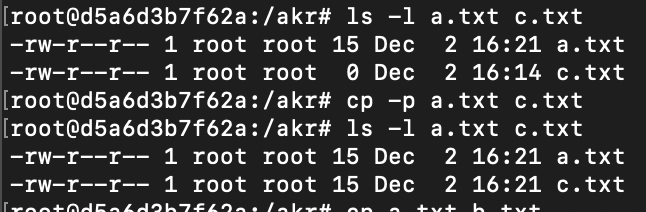
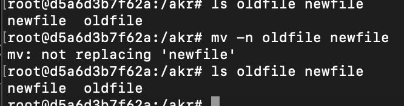
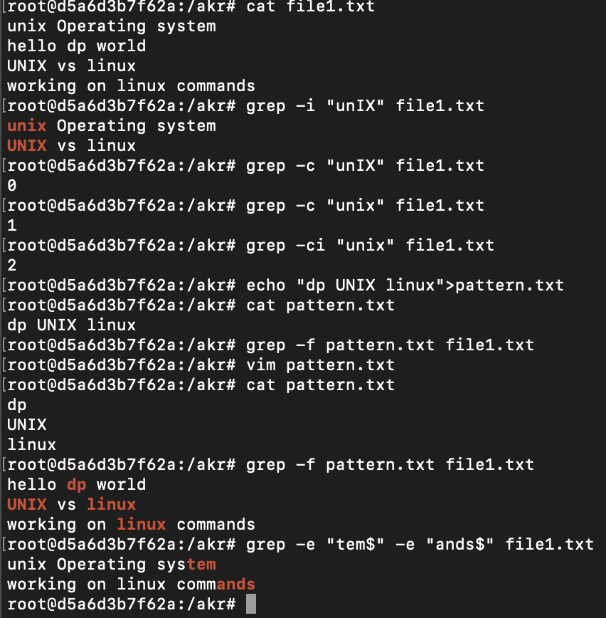

Operating System Basics:

An operating system (OS) is a complex collection of software that acts as the foundation of a computer system, managing all hardware resources and providing a platform for application software to run.

Acts as a bridge between User & computer hardware

Operating System architecture :

In the typical operating system architecture (see the figure below) the operating system kernel is responsible for access and sharing the hardware in a secure and fair manner with multiple applications.

Responsibilities:

Process Management

manages all running programs (called processes)

OS coordinates execution of multiple programs simultaneously through -> Scheduling, Multitasking, Process creation & termination, Inter-process communication

Resource Management

structured way to store & retrieve data through -> File Organization, Access control, File operations, Different file formats

software intermediaries -> Device drivers, I/O management, Buffering & catching, Plug & play

memory management - allocation & deallocation when not needed

user/group management - User login, permissions, firewalls, encryption

| Feature | Windows | MacOS | Linux |
| --- | --- | --- | --- |
| Developer | Microsoft | Apple | Open-source Community |
| Ease of Use | easy | easy | depends on distro |
| Hardware Compatibility | Runs on any PC hardware | Only official Apple hardware | Runs on almost any hardware, great for old PCs |
| Security | Most targeted, requires antivirus | Strong - sandboxing, Gatekeeper | Most secure - open-source, fewer threats     Reason: By default least previlege is given to everything |
| Viruses/Malware | High risk, needs protection | Low to moderate risk | Very low risk |
| Customization | Moderate - theme changes, third-party tools | Limited - minor tweaks only | Extreme - change anything and everything |
| Ecosystem Integration | Good - Microsoft 365, Xbox, OneDrive | Excellent - iPhone, iPad, Apple Watch seamless | Variable - depends on services used |
| Server & Cloud Use | Used in enterprises | Almost unused | Over 90% of cloud servers run on Linux |
| Support | Official Microsoft support, huge community | Apple Support, Genius Bar, smaller community | Community-driven forums, wikis, IRC |
| Bootup Time | Moderate | Fast, especially on M-series | seriesVery fast (especially lightweight distros) |
| User Interface | Start menu, taskbar, customizable | Dock, menu bar, minimalist, less customizable | Varies by distro , highly customizable |
|  |  |  |  |

Linux Architecture:

┌──────────────────────┐

│           USER APPLICATIONS                                  |

│  (Web browsers, editors, games, etc.)                   │

└──────────────────────┘

↕

┌──────────────────────┐

│         SYSTEM LIBRARIES & UTILITIES                 │

│    (GNU C Library, System Utilities)                       │

└──────────────────────┘

↕

┌──────────────────────┐

│            SYSTEM CALL INTERFACE                       │

│         (Bridge between user/kernel)                         │

└──────────────────────┘

↕

┌──────────────────────┐

│                   LINUX KERNEL                                   │

│  (Core OS - manages hardware & resources)       │

└──────────────────────┘

↕

┌──────────────────────┐

│               HARDWARE LAYER                                │

│     (CPU, RAM, Disk, Network, etc.)                       │

└──────────────────────┘

This architecture makes Linux powerful, flexible, secure, and suitable for everything from embedded devices to supercomputers.

Linux does not use any source code from Unix. It's simply designed to work similarly to the Unix kernel. For that reason, Linux is often described as a Unix-like kernel. Linux can be used to run systems that are like Unix, but Linux is not Unix.

Key Principles:

Everything is a file

Small, focused programs --> Unix philosophy: do one thing well

Text-based configuration --> human readable config files in /etc

Hierarchial file system - >single unified tree structure

Multi - user by design - > strong permission & security model

Open source

Main Components of Linux Architecture:

Kernel

Core part of Linux. Manages hardware, memory, processes, and system calls.

Types of kernels: monolithic (Linux is monolithic), modular. Examples of kernel tasks: process scheduling, memory management, device drivers.

Shell

Interface between the user and kernel.

Common shells: bash, zsh, sh, fish.

It interprets commands entered by users and scripts.

File System

Hierarchical directory structure starting from /. Organizes files, directories, and devices.

1. Linux Kernel:

In the typical operating system architecture (see the figure below) the operating system kernel is responsible for access and sharing the hardware in a secure and fair manner with multiple applications.

A kernel is a special program responsible for managing the low-level functions of a computer.

it's the kernel that provides the most crucial and most basic functionality at the heart of the operating system by unifying hardware and software.

The kernel offers a set of APIs that applications issue which are generally referred to as "System Calls". These APIs are different from regular library APIs because they are the boundary at which the execution mode switch from user mode to kernel mode.

In order to provide application compatibility, system calls are rarely changed.

Linux is just one of thousands of kernels in existence.

The Linux kernel is the kernel used by Linux-based operating systems and the interface between the hardware and the computer processes

Linux used to refer to any operating system that uses Linux as its kernel.

the term Linux can be used to refer specifically to the kernel or to any operating system that uses the Linux kernel in addition to programs from other sources in order to provide a complete operating system.

Linux kernel uses monolithic kernel architecture. i.e. kernel runs as a single program.

Features:

Resource Management

Input/Output

System calls(Process Management)

Device management

Memory management

File system management

2.Shell

Interface between the user and kernel.

Common shells: bash, zsh, sh, fish.

It interprets commands entered by users and scripts.

Shell Functions:

Command execution - runs programs and utilities

Scripting - automate tasks with shell scripts

Job control - background/foreground processes, process management

I/O redirection - redirect input/output using >, <, |

Environment variables - PATH, HOME, USER, etc.

Command history - recall previous commands

Tab completion - auto-complete file names and commands

Wildcards and globbing - *, ?, [] for pattern matching

Popular Shells:

bash (Bourne Again Shell) - most common, default on many distributions

zsh (Z Shell) - enhanced features, better customization

fish (Friendly Interactive Shell) - user-friendly, syntax highlighting

sh (Bourne Shell) - original Unix shell, simple and portable

csh/tcsh - C-like syntax

ksh (Korn Shell) - combines features of bash and csh

3.File System

Hierarchical directory structure starting from / (root).

Organizes files, directories, and devices.

"Everything is a file" philosophy - devices, processes, and sockets are treated as files.

File System Hierarchy Standard (FHS):

| Directory | Purpose |
| --- | --- |
| / | Root directory - top of the hierarchy |
| /bin | Essential user command binaries (ls, cp, cat) |
| /boot | Boot loader files, kernel images, initrd |
| /dev | Device files (hardware represented as files) |
| /etc | System configuration files |
| /home | User home directories (/home/username) |
| /lib | Essential shared libraries and kernel modules |
| /media | Mount points for removable media (USB, CD/DVD) |
| /mnt | Temporary mount points |
| /opt | Optional/add-on software packages |
| /proc | Virtual filesystem - process and kernel information |
| /root | Root user's home directory |
| /run | Runtime data (process IDs, sockets) |
| /sbin | System administration binaries (requires root) |
| /srv | Service data (web servers, FTP) |
| /sys | Virtual filesystem - kernel and device information |
| /tmp | Temporary files (cleared on reboot) |
| /usr | User programs, libraries, documentation |
| /usr/bin | User command binaries |
| /usr/lib | Libraries for /usr/bin programs |
| /usr/local | Locally installed software |
| /usr/share | Architecture-independent data |
| /var | Variable data (logs, caches, mail, databases) |
| /var/log | Log files |
| /var/tmp | Temporary files (preserved across reboots) |

File Types:

Regular files (-) - text, binary, images, etc.

Directories (d) - containers for files

Symbolic links (l) - shortcuts to other files

Character devices (c) - serial devices, terminals

Block devices (b) - hard drives, USB drives

Sockets (s) - inter-process communication

Named pipes (p) - FIFO communication

File Permissions:

r - 4 ;  w - 2 ;   x - 1;

Boot Process

Booting is the process of loading an operating system. It’s the process that starts when we turn on the computer (using the power button or by a software command) and ends when the operating system is loaded into the memory.

1. BIOS/UEFI

↓

2. Bootloader (GRUB2)

↓

3. Kernel Initialization

↓

4. Init System (systemd/init)

↓

5. System Services

↓

6. Login Prompt

Running BIOS/UEFI

When we turn on the computer, there is no program inside the computer’s main memory (RAM), so the CPU looks for another program, called the  (Basic Input/Output System), and runs it.

The BIOS is a firmware that is located on the motherboard and is run by the CPU to start the booting sequence:

First code that runs when computer powers on

Stored in ROM/Flash memory on motherboard

Performs POST (Power-On Self Test)

Checks and initializes hardware components

UEFI (Unified Extensible Firmware Interface) - Modern System

Modern replacement for BIOS

More advanced and feature-rich

Supports larger disks (>2TB with GPT)

Faster boot times

Graphical interface with mouse support

POST (Power-On Self Test):

After the BIOS starts running, it starts a process called  (Power-On Self-Test) which tests all the hardware devices(CPU, RAM, keyboard, disk drives) and makes sure there are no issues. Moreover, if POST finds some issues in the hardware, the booting process stops and the computer fails to boot.

Boot Device Selection:

Checks boot order in BIOS settings

Looks for bootable device (hard drive, USB, CD/DVD, network)

Reads MBR (Master Boot Record) from boot device

MBR is first 512 bytes of disk

Contains bootloader code and partition table

Bootloader

The bootloader is a small program that loads the operating system kernel into memory.

After loading the MBR into RAM, the BIOS runs the first instruction loaded from the MBR. The first instruction is typically the bootstrap code, aka the bootloader, which is a program written in machine code that loads the operating system into RAM.

Each operating system has its own bootloaders. For example, ,  (Linux Loader), and rEFInd are a few popular Linux bootloaders

Kernel Initialisation

Detect hardware (CPU, RAM, Storage, USB, etc.)

Load drivers

Mount root filesystem temporarily using initramfs

Start PID 1 (first process)

BUT the kernel cannot directly mount the real filesystem yet — so it uses initramfs(Initial RAM FileSystem).

Init System

The init system is the first user-space program (PID 1) that starts all other processes.

systemd starts as PID 1

Reads configuration from /etc/systemd/

Determines boot target (similar to runlevel)

graphical.target - GUI

multi-user.target - Multi-user text mode

rescue.target - Single-user rescue mode

Starts services in parallel according to dependencies

Mounts filesystems

Activates network

Start display manager (for GUI)

Start login services

┌──────────────────────┐

│                  USER APPLICATIONS                           │

│     (Firefox, LibreOffice, Games, Text Editors)         │

└──────────────────────┘

↕

┌──────────────────────┐

│                  SYSTEM UTILITIES                               │

│      (ls, cp, grep, ps, top, bash commands)             │

└──────────────────────┘

↕

┌─────────────────────┐

│                       SHELL                                           │

│          (bash, zsh, fish - Command Interpreter)    │

└─────────────────────┘

↕

┌─────────────────────┐

│                  SYSTEM LIBRARIES                          │

│              (glibc, libpthread, libm)                           │

└─────────────────────┘

↕

System Call Interface (SCI)

↕

┌────────────────────────────┐

│                    LINUX KERNEL                                                          │

│  ┌───────┐ ┌──────┐ ┌────────┐  │

│  │  Process          │ │   Memory     │ │    File System       │  │

│  │ Management   │ │ Management│ │    (VFS Layer)       │  │

│  └───────┘ └──────┘ └────────┘  │

│                                                                                                       │

│  ┌─────┐ ┌────┐ ┌──────────┐         │

│  │   Device    │ │  Networ│ │  IPC (Pipes,                 │         │

│  │   Drivers   │  │   Stack  │ │  Signals, Sockets)      │         │

│  └─────┘ └────┘ └──────────┘

└────────────────────────────┘

↕

┌─────────────────────────────┐

│                      HARDWARE                                                              │

│   (CPU, RAM, Hard Disk, Network Card, Peripherals)                    │

└─────────────────────────────┘

Navigation Commands: ls, cd, pwd, tree

| ls | -l | Long listing format |
| --- | --- | --- |
| ls | -a | show all files including hidden |
| ls | -h | list in human readable format |
| ls | -R | recursively list sub directories |
| ls | -lt | sort by time in long listing format |
| ls | -lah | long list including hidden in human readable format |
| ls | -lu | Long list with UID & Group ID |
| ls | -ltc | Long list sorted by ctime |
| ls | -lis | Long list with index numbers sorted by size, largest first |
| ls | -ald | List directories only |
| cd | cd
cd $HOME
cd ~ | Navigate to home directory |
|  | cd ../.. | To navigate 2 steps back in directory path |
| tree | -a | Display complete hierarchical structure |
| tree | -P sample* . | list only those files and directories that match a specified pattern |
| tree | --filelimit 3 ./GFG | Display only those directories that contain > N(specified) files |
| tree | -p ./bin | List files with their permissions |
| tree | --noreport | Omits printing of the file and directory report at the end of the tree listing |

File operations: cat, cp, mv, rm, touch, mkdir

| cat | -n   file1.txt | Display file with line number |
| --- | --- | --- |
| cat | -b file1.txt |  |
| cat | -T file1.txt |  |
| cat | > newfile.txt | Create new file |
| cat | >> existing.txt | Adds content at the end of file |
| cat | -E file1.txt | Show $ at end of each line(displays hidden characters) |
| cat | -s | Converts multiple empty lines into one. |
| cat | -- "-dashfile" | To open dashfile |
| cp | -R/-r | copy files recursively |
| cp | -i | interactive copying |
| cp | -f | writing forcefully to a write protected file |
| cp | -p | preserves the last date modification& time of last access, ownership & file permission bits |
| cp | -f | Copying content to write restricted file forcefully |
| mv | -i | interactive mode(asks permission before moving) |
| mv | -f | force move |
| mv | -n | don’t overwrite existing file |
| mv | -v | verbose |
| mv | -b | to take a backup of an existing file that will be overwritten |

| mkdir | -p | create parent directories if they don’t exist |
| --- | --- | --- |
| mkdir | -m 755 dir-name | set permissions for new directories(-m 755) |
| rm | -i | interactive deletion |
| rm | -f | force deletion |
| rm | -r/-R | recursive deletion |
| rmdir | -p | -delete including subdirectories |
| rmdir | -v | verbose |
| touch | -a | updates only access time(atime) of a file to current  time |
| touch | -m | change modificatin time only |
| touch | -c | don’t create a new file if it doesn’t already exists |
| touch | -r refe.txt target.txt | copies both access & mtimes |
| touch | -t YYMMDDhhmm.ss | set custom timestamp. same for atime& mtime |

Text processing: grep, find, awk, sed, cut, sort, uniq

| grep | -i “Unix”  file1.txt | case insensitive search |
| --- | --- | --- |
| grep | -c “unix”  file2.txt | displaying count matches |
| grep | -l  “unix”  f1.txt f2.txt f3.txt | display the files that contain the given string pattern |
| grep | -n | to show the line numbers for the mathched pattern |
| grep | “^unix” | match the lines starting with the given string |
| grep | “os$” | match the lines which end with the given string |
| grep | -e “unix1” -e “unix2” | to check multiple patterns |
| grep | -f pattern.txt file1.txt | serach for multiple patterns listed in a seperate file |
| grep | -A1 | Print num lines of trailing context after each match |
| grep | -B3 | Print num lines of leading context before each match |
| grep | -C2 | Print num lines of leading and trailing context surrounding each match. |

| find | find ./GFG -name file1.txt | searching for file1 in GFG directory |
| --- | --- | --- |
| find | find ./GFG -name file1.txt -exec rm -i {} \ ; | locate file & delete it |
| find | find ./GFG -empty | search for empty files in GFG directory |
| find | find ./GFG -perm 664 | search for files with specific permissions |
| find | find   .   -type  d | display the hierarchical |
| find | find /path/to/search -mtime -7 | will list files modified in the last week |
| find | find  /   -type f  -size  +100M | find files with >100MB size across the entire system |
| find | find  . -maxdepth 2 -name “*.txt” |  |
| find | find  .  -type  f  -exec  grep  -l  “pattern” {} \; | display the names of the files containing the specified content |
| find | -i  ( i.e -iname) | case insensitive search |

awk Built-in variables

| Variable | Meaning | Description |
| --- | --- | --- |
| $0 | Entire line | Represents the whole input line |
| $1, $2, … | Field variables | Represent individual fields |
| NR | Record number | Current line number being processed |
| NF | Number of fields | Total number of fields in a line |
| FS | Field separator | Character separating fields (default: space) |
| RS | Record separator | Character separating records (default: newline) |
| OFS | Output field separator | Used between output fields (default: space) |
| ORS | Output record separator | Used between output records (default: newline) |

cat employee.txt

ajay manager account 45000

sunil clert account 25000

varun manager sales 50000

amit manager account 47000

tarun peon sales 50000

deepak clerk sales 23000

sunit peon sales 13000

awk '{print}' employee.txt

ajay manager account 45000

sunil clert account 25000

varun manager sales 50000

amit manager account 47000

tarun peon sales 50000

deepak clerk sales 23000

sunit peon sales 13000

# takes space as field seperator

awk -F' ' '{print $1,$4}' employee.txt

ajay 45000

sunil 25000

varun 50000

amit 47000

tarun 50000

deepak 23000

sunit 13000

awk -F' ' '{print $1, "has salary", $4}' employee.txt

ajay has salary 45000

sunil has salary 25000

varun has salary 50000

amit has salary 47000

tarun has salary 50000

deepak has salary 23000

sunit has salary 13000

# define varaibles before awk process begins

awk -v msg="Employee Details:" 'BEGIN {print msg}' employee.txt

Employee Details:

# use of variable in condition

awk -v limit=40000 '$4 > limit {print $1, $4}' employee.txt

ajay 45000

varun 50000

amit 47000

tarun 50000

# search lines with ‘manager’ keyword

awk '/manager/ {print}' employee.txt

ajay manager account 45000

varun manager sales 50000

amit manager account 47000

# display line number

awk '{print NR, $0}' employee.txt

1 ajay manager account 45000

2 sunil clert account 25000

3 varun manager sales 50000

4 amit manager account 47000

5 tarun peon sales 50000

6 deepak clerk sales 23000

7 sunit peon sales 13000

# NF – display last field

awk '{print $1, $NF}' employee.txt

ajay 45000

sunil 25000

varun 50000

amit 47000

tarun 50000

deepak 23000

sunit 13000

awk 'NR==3, NR==6 {print NR, $0}' employee.txt

3 varun manager sales 50000

4 amit manager account 47000

5 tarun peon sales 50000

6 deepak clerk sales 23000

awk '{print NR "-" $1}' employee.txt

1-ajay

2-sunil

3-varun

4-amit

5-tarun

6-deepak

7-sunit

awk '{ if (length($0) > max) max = length($0) } END { print max }' employee.txt

26

awk 'END { print NR }' employee.txt

7

# generate and print the squares of numbers from 1 to 6.

awk 'BEGIN { for(i=1;i<=6;i++) print "square of", i, "is",i*i; }'

square of 1 is 1

square of 2 is 4

square of 3 is 9

square of 4 is 16

square of 5 is 25

square of 6 is 36

sed

The sed command in Linux, short for stream editor, is a non-interactive text editor used to perform basic text transformations on an input stream, such as a file or input from a pipeline. It processes text line by line, applying the editing commands you specify.

| Option | Description |
| --- | --- |
| -i | Edit the file in-place (overwrite) |
| -n | Suppress automatic printing of lines. |
| -e | Allows multiple commands. |
| -f | Reads sed commands from a file. |
| -r | Use extended regular expressions. |

cat sample.txt

unix is great os. unix is opensource. unix is free os.

learn operating system.

unix linux which one you choose.

unix is easy to learn.unix is a multiuser os.Learn unix .unix is a powerful.

# replacing a string

sed 's/unix/linux/' sample.txt

linux is great os. unix is opensource. unix is free os.

learn operating system.

linux linux which one you choose.

linux is easy to learn.unix is a multiuser os.Learn unix .unix is a powerful.

# replacing nth occurance of a pattern in a line

sed 's/unix/linux/2' sample.txt

unix is great os. linux is opensource. unix is free os.

learn operating system.

unix linux which one you choose.

unix is easy to learn.linux is a multiuser os.Learn unix .unix is a powerful.

# replacing all the occurances of the pattern in a line

sed 's/unix/linux/g' sample.txt

linux is great os. linux is opensource. linux is free os.

learn operating system.

linux linux which one you choose.

linux is easy to learn.linux is a multiuser os.Learn linux .linux is a powerful.

#Replacing from nth Occurance to all Occurances in a line

sed 's/linux/unix/3g' sample.txt

unix is great os. unix is opensource. unix is free os.

learn operating system.

unix linux which one you choose.

unix is easy to learn.unix is a multiuser os.Learn unix .unix is a powerful.

# Parenthesize First Character of each word

echo "Welcome To The Linux World" | sed 's/\(\b[A-Z]\)/\(\1\)/g'

(W)elcome (T)o (T)he (L)inux (W)orld

#Replacing String on a Range of lines

sed '1,3 s/unix/linux/' sample.txt

linux is great os. unix is opensource. unix is free os.

learn operating system.

linux linux which one you choose.

unix is easy to learn.unix is a multiuser os.Learn unix .unix is a powerful.

Delete lines from a file

sed '5d' sample.txt  # delete 5th line

sed '3,6d' sample.txt  # delete line from range

sed '12,$d' sample.txt  # delete from nth to last line

sed '/pattern/d' sample.txt  # delete pattern matching line

cut

cat states.txt

Andhra Pradesh Amaravati

Assam Dispur

Bihar patna

Telangana Hyderabad

Kerala trivandram

Rajastan Jaipur

Gujarat GandhiNager

#extract 2nd & 3rd fields from each line

cut -d " " -f 2,3 states.txt

Pradesh Amaravati

Dispur

patna

Hyderabad

trivandram

Jaipur

GandhiNager

#extract 1st,2nd & 3rd bytes from each line

cut -b 1,2,3 states.txt

And

Ass

Bih

Tel

Ker

Raj

Guj

#extract list with ranges

cut -b 1-3,5-7 states.txt

Andra

Assm D

Bihr p

Telnga

Kerla

Rajsta

Gujrat

#select bytes from begin to end

cut -b 1- states.txt

Andhra Pradesh Amaravati

Assam Dispur

Bihar patna

Telangana Hyderabad

Kerala trivandram

Rajastan Jaipur

Gujarat GandhiNager

#Cut by character

cut -c 2,5,7 states.txt

nr

smD

irp

ena

el

asa

urt

cut -c 1-7 states.txt

Andhra

Assam D

Bihar p

Telanga

Kerala

Rajasta

Gujarat

# # select characters from begin to end

cut -c 1- states.txt

Andhra Pradesh Amaravati

Assam Dispur

Bihar patna

Telangana Hyderabad

Kerala trivandram

Rajastan Jaipur

Gujarat GandhiNager

# print from starting to 5th character

cut -c -5 states.txt

Andhr

Assam

Bihar

Telan

Keral

Rajas

Gujar

Pipes and redirection: |, >, >>, <, 2>&1

ls

a.txt  c.txt  employee.txt  new     newdir1  newfile~     sample.txt

b.txt  dir1   file1.txt     newdir  newfile  pattern.txt  states.txt

ls |wc -l

14

# cat sample.txt |wc -l

4

# cat sample.txt |grep "linux"

unix linux which one you choose.

cat sample.txt

unix is great os. unix is opensource. unix is free os.

learn operating system.

unix linux which one you choose.

unix is easy to learn.unix is a multiuser os.Learn unix .unix is a powerful.

cat sample.txt |grep "unix"

unix is great os. unix is opensource. unix is free os.

unix linux which one you choose.

unix is easy to learn.unix is a multiuser os.Learn unix .unix is a powerful.

# save output to a file

ls > output.txt

cat output.txt

a.txt

b.txt

c.txt

dir1

employee.txt

file1.txt

new

newdir

newdir1

newfile

newfile~

output.txt

pattern.txt

sample.txt

states.txt

date > b.txt

cat b.txt

Tue Dec  2 23:53:13 +04 2025

echo "new entry" >> b.txt

cat b.txt

Tue Dec  2 23:53:13 +04 2025

new entry

cat < a.txt

a file content

sort states.txt

Andhra Pradesh Amaravati

Assam Dispur

Bihar patna

Gujarat GandhiNager

Kerala trivandram

Rajastan Jaipur

Telangana Hyderabad

sort < states.txt

Andhra Pradesh Amaravati

Assam Dispur

Bihar patna

Gujarat GandhiNager

Kerala trivandram

Rajastan Jaipur

Telangana Hyderabad

ls /fackepath 2> errors.txt

cat errors.txt

ls: cannot access '/fackepath': No such file or directory

touch dir1/f1.txt dir1/f2.txt

ls /dir1 /fakepath > output.txt 2>&1

cat output.txt

ls: cannot access '/dir1': No such file or directory

ls: cannot access '/fakepath': No such file or directory

ls dir1 /fakepath >> output.txt 2>&1

cat output.txt

ls: cannot access '/dir1': No such file or directory

ls: cannot access '/fakepath': No such file or directory

ls: cannot access '/fakepath': No such file or directory

dir1:

f1.txt

f2.txt

cat employee.txt

ajay manager account 45000

sunil clert account 25000

varun manager sales 50000

amit manager account 47000

tarun peon sales 50000

deepak clerk sales 23000

sunit peon sales 13000

sort< employee.txt >> sorted.txt

cat sorted.txt

ajay manager account 45000

amit manager account 47000

deepak clerk sales 23000

sunil clert account 25000

sunit peon sales 13000

tarun peon sales 50000

varun manager sales 50000

#Print file sorted, remove blank lines & format

cat states.txt| sed '/^$/d' |sort | nl

1	Andhra Pradesh Amaravati

2	Assam Dispur

3	Bihar patna

4	Gujarat GandhiNager

5	Kerala trivandram

6	Rajastan Jaipur

7	Telangana Hyderabad

cat states.txt| sed '/^ $/d' |sort | nl

1	Andhra Pradesh Amaravati

2	Assam Dispur

3	Bihar patna

4	Gujarat GandhiNager

5	Kerala trivandram

6	Rajastan Jaipur

7	Telangana Hyderabad

cat states.txt| sed '/^' '$/d' |sort | nl

sed: -e expression #1, char 2: unterminated address regex

cat notes.txt | sed '/^$/d' | sort | nl

cat: notes.txt: No such file or directory

cat states.txt | sed '/^$/d' | sort | nl

1	Andhra Pradesh Amaravati

2	Assam Dispur

3	Bihar patna

4	Gujarat GandhiNager

5	Kerala trivandram

6	Rajastan Jaipur

7	Telangana Hyderabad

cat states.txt | sed '/^$/d' | sort

Andhra Pradesh Amaravati

Assam Dispur

Bihar patna

Gujarat GandhiNager

Kerala trivandram

Rajastan Jaipur

Telangana Hyderabad

cat states.txt | sed '/^$/d' | sort |ln

ln: missing file operand

Try 'ln --help' for more information.

cat states.txt | sed '/^$/d' | sort | nl

1	Andhra Pradesh Amaravati

2	Assam Dispur

3	Bihar patna

4	Gujarat GandhiNager

5	Kerala trivandram

6	Rajastan Jaipur

7	Telangana Hyderabad

ls

a.txt  bash_users.txt  dir1          errors.txt  new     newdir1  newfile~    pattern.txt  sorted.txt

b.txt  c.txt           employee.txt  file1.txt   newdir  newfile  output.txt  sample.txt   states.txt

cat file1.txt

unix Operating system

hello dp world

UNIX vs linux

working on linux commands

vim file1.txt

cat file1.txt

unix Operating system

hello dp world

UNIX vs linux

working on linux commands

cat file1.txt | sed '/^$/d' | sort | nl

1	UNIX vs linux

2	hello dp world

3	unix Operating system

4	working on linux commands

ls -lah

total 72K

drwxr-xr-x 6 root root 4.0K Dec  3 00:09 .

drwxr-xr-x 1 root root 4.0K Dec  2 20:14 ..

-rw-r--r-- 1 root root   15 Dec  2 20:21 a.txt

-rw-r--r-- 1 root root   39 Dec  2 23:53 b.txt

-rw-r--r-- 1 root root   12 Dec  3 00:02 bash_users.txt

-rw-r--r-- 1 root root   15 Dec  2 20:21 c.txt

drwxrwxrwx 2 root root 4.0K Dec  2 23:57 dir1

-rw-r--r-- 1 root root  177 Dec  2 21:52 employee.txt

-rw-r--r-- 1 root root   58 Dec  2 23:55 errors.txt

-rw-r--r-- 1 root root   79 Dec  3 00:09 file1.txt

drwxr-xr-x 2 root root 4.0K Dec  2 20:16 new

drwxrwxrwx 2 root root 4.0K Dec  2 20:48 newdir

drwxrwxrwx 2 root root 4.0K Dec  2 20:50 newdir1

-rw-r--r-- 1 root root    0 Dec  2 20:35 newfile

-rw-r--r-- 1 root root    0 Dec  2 20:35 newfile~

-rw-r--r-- 1 root root  187 Dec  2 23:58 output.txt

-rw-r--r-- 1 root root   16 Dec  2 21:39 pattern.txt

-rw-r--r-- 1 root root  189 Dec  2 22:45 sample.txt

-rw-r--r-- 1 root root  177 Dec  3 00:01 sorted.txt

-rw-r--r-- 1 root root  124 Dec  2 23:16 states.txt

ls -lah | sort

-rw-r--r-- 1 root root    0 Dec  2 20:35 newfile

-rw-r--r-- 1 root root    0 Dec  2 20:35 newfile~

-rw-r--r-- 1 root root   12 Dec  3 00:02 bash_users.txt

-rw-r--r-- 1 root root   15 Dec  2 20:21 a.txt

-rw-r--r-- 1 root root   15 Dec  2 20:21 c.txt

-rw-r--r-- 1 root root   16 Dec  2 21:39 pattern.txt

-rw-r--r-- 1 root root   39 Dec  2 23:53 b.txt

-rw-r--r-- 1 root root   58 Dec  2 23:55 errors.txt

-rw-r--r-- 1 root root   79 Dec  3 00:09 file1.txt

-rw-r--r-- 1 root root  124 Dec  2 23:16 states.txt

-rw-r--r-- 1 root root  177 Dec  2 21:52 employee.txt

-rw-r--r-- 1 root root  177 Dec  3 00:01 sorted.txt

-rw-r--r-- 1 root root  187 Dec  2 23:58 output.txt

-rw-r--r-- 1 root root  189 Dec  2 22:45 sample.txt

drwxr-xr-x 1 root root 4.0K Dec  2 20:14 ..

drwxr-xr-x 2 root root 4.0K Dec  2 20:16 new

drwxr-xr-x 6 root root 4.0K Dec  3 00:09 .

drwxrwxrwx 2 root root 4.0K Dec  2 20:48 newdir

drwxrwxrwx 2 root root 4.0K Dec  2 20:50 newdir1

drwxrwxrwx 2 root root 4.0K Dec  2 23:57 dir1

total 72K

ls -lSh

total 64K

drwxrwxrwx 2 root root 4.0K Dec  2 23:57 dir1

drwxr-xr-x 2 root root 4.0K Dec  2 20:16 new

drwxrwxrwx 2 root root 4.0K Dec  2 20:48 newdir

drwxrwxrwx 2 root root 4.0K Dec  2 20:50 newdir1

-rw-r--r-- 1 root root  189 Dec  2 22:45 sample.txt

-rw-r--r-- 1 root root  187 Dec  2 23:58 output.txt

-rw-r--r-- 1 root root  177 Dec  2 21:52 employee.txt

-rw-r--r-- 1 root root  177 Dec  3 00:01 sorted.txt

-rw-r--r-- 1 root root  124 Dec  2 23:16 states.txt

-rw-r--r-- 1 root root   79 Dec  3 00:09 file1.txt

-rw-r--r-- 1 root root   58 Dec  2 23:55 errors.txt

-rw-r--r-- 1 root root   39 Dec  2 23:53 b.txt

-rw-r--r-- 1 root root   16 Dec  2 21:39 pattern.txt

-rw-r--r-- 1 root root   15 Dec  2 20:21 a.txt

-rw-r--r-- 1 root root   15 Dec  2 20:21 c.txt

-rw-r--r-- 1 root root   12 Dec  3 00:02 bash_users.txt

-rw-r--r-- 1 root root    0 Dec  2 20:35 newfile

-rw-r--r-- 1 root root    0 Dec  2 20:35 newfile~

ls -lsh

total 64K

4.0K -rw-r--r-- 1 root root   15 Dec  2 20:21 a.txt

4.0K -rw-r--r-- 1 root root   39 Dec  2 23:53 b.txt

4.0K -rw-r--r-- 1 root root   12 Dec  3 00:02 bash_users.txt

4.0K -rw-r--r-- 1 root root   15 Dec  2 20:21 c.txt

4.0K drwxrwxrwx 2 root root 4.0K Dec  2 23:57 dir1

4.0K -rw-r--r-- 1 root root  177 Dec  2 21:52 employee.txt

4.0K -rw-r--r-- 1 root root   58 Dec  2 23:55 errors.txt

4.0K -rw-r--r-- 1 root root   79 Dec  3 00:09 file1.txt

4.0K drwxr-xr-x 2 root root 4.0K Dec  2 20:16 new

4.0K drwxrwxrwx 2 root root 4.0K Dec  2 20:48 newdir

4.0K drwxrwxrwx 2 root root 4.0K Dec  2 20:50 newdir1

0 -rw-r--r-- 1 root root    0 Dec  2 20:35 newfile

0 -rw-r--r-- 1 root root    0 Dec  2 20:35 newfile~

4.0K -rw-r--r-- 1 root root  187 Dec  2 23:58 output.txt

4.0K -rw-r--r-- 1 root root   16 Dec  2 21:39 pattern.txt

4.0K -rw-r--r-- 1 root root  189 Dec  2 22:45 sample.txt

4.0K -rw-r--r-- 1 root root  177 Dec  3 00:01 sorted.txt

4.0K -rw-r--r-- 1 root root  124 Dec  2 23:16 states.txt

ls -lSh

total 64K

drwxrwxrwx 2 root root 4.0K Dec  2 23:57 dir1

drwxr-xr-x 2 root root 4.0K Dec  2 20:16 new

drwxrwxrwx 2 root root 4.0K Dec  2 20:48 newdir

drwxrwxrwx 2 root root 4.0K Dec  2 20:50 newdir1

-rw-r--r-- 1 root root  189 Dec  2 22:45 sample.txt

-rw-r--r-- 1 root root  187 Dec  2 23:58 output.txt

-rw-r--r-- 1 root root  177 Dec  2 21:52 employee.txt

-rw-r--r-- 1 root root  177 Dec  3 00:01 sorted.txt

-rw-r--r-- 1 root root  124 Dec  2 23:16 states.txt

-rw-r--r-- 1 root root   79 Dec  3 00:09 file1.txt

-rw-r--r-- 1 root root   58 Dec  2 23:55 errors.txt

-rw-r--r-- 1 root root   39 Dec  2 23:53 b.txt

-rw-r--r-- 1 root root   16 Dec  2 21:39 pattern.txt

-rw-r--r-- 1 root root   15 Dec  2 20:21 a.txt

-rw-r--r-- 1 root root   15 Dec  2 20:21 c.txt

-rw-r--r-- 1 root root   12 Dec  3 00:02 bash_users.txt

-rw-r--r-- 1 root root    0 Dec  2 20:35 newfile

-rw-r--r-- 1 root root    0 Dec  2 20:35 newfile~

find .  -type f  -printf "%s %p\n" 2>&1 | sort -nr | head -5 >largest.txt

cat largest.txt

189 ./sample.txt

187 ./output.txt

177 ./sorted.txt

177 ./employee.txt

124 ./states.txt

#Redirect Output of a loop

for i in {1..5}; do echo "value: $i"; done >loop_output.txt

cat loop_output.txt

value: 1

value: 2

value: 3

value: 4

value: 5

replace spaces with '-'

cat employee.txt | tr ' ' '-' | sed 's/ */ /g' >clean.txt

cat clean.txt

a j a y - m a n a g e r - a c c o u n t - 4 5 0 0 0

s u n i l - c l e r t - a c c o u n t - 2 5 0 0 0

v a r u n - m a n a g e r - s a l e s - 5 0 0 0 0

a m i t - m a n a g e r - a c c o u n t - 4 7 0 0 0

t a r u n - p e o n - s a l e s - 5 0 0 0 0

d e e p a k - c l e r k - s a l e s - 2 3 0 0 0

s u n i t - p e o n - s a l e s - 1 3 0 0 0

RegEx

| NO | EXPRESSION | DESCRIPTION |
| --- | --- | --- |
| 1 | . | This metacharacter replaces any character. |
| 2 | ^ | This metacharacter matches the start of the string and represents characters not in the string. |
| 3 | $ | This metacharacter matches the end of the string. |
| 4 | * | This metacharacter Matches zero or more times the preceding character. |
| 5 | \ | This metacharacter represents the group of characters. |
| 6 | () | This metacharacter Group regular expressions. |
| 7 | ? | This metacharacter Matches exactly one character. |
| 8 | + | This metacharacter matches one or more times the preceding character. |
| 9 | {N} | Preceding character is matched exactly N times. |
| 10 | {N,} | Preceding character is matched exactly N times or more. |
| 11 | {N, M} | Preceding character is matched exactly N times, but not more than N times. |
| 12 | – | This metacharacter represents the range. |
| 13 | \b | This metacharacter matches the empty string at the edge of a word. |
| 15 | \B | This metacharacter matches the empty string if it is not at the edge of a word. |
| 16 | \< | This metacharacter matches the empty string at the beginning of a word. |
| 17 | \> | This metacharacter matches the empty string at the end of a word. |

https://data-flair.training/blogs/regular-expression-in-linux/

cat fruits.txt

Apple

Banana

Custard Apple

Dates

Grape

Jujube

Jamun

Lime

BlueBerry

Blackbery

Orange

Lychee

Pineapple

Pomegranate

Quince

Tangerine

cantaloupe

Blackcurrent

Rasberry

Gauva

Mango

Sstart Fruit

Chico fruit

Miracle Fruit

Star Fruit

Dragon fruit

cat fruits.txt | grep -i app.e

Apple

Custard Apple

Pineapple

cat fruits.txt | grep e$

Apple

Custard Apple

Grape

Jujube

Lime

Orange

Lychee

Pineapple

Pomegranate

Quince

Tangerine

Cantaloupe

# Using "*" to find any number of repetition of a string

cat fruits.txt | grep -i  fru.t

Sstart Fruit

Chico fruit

Miracle Fruit

Star Fruit

Dragon fruit

cat fruits.txt | grep -i  ap*le

Apple

Custard Apple

Pineapple

rootcat fruits.txt | grep '\ '

Custard Apple

Sstart Fruit

Chico fruit

Miracle Fruit

Star Fruit

Dragon fruit

cat fruits.txt | grep -E "(fruit)"

Chico fruit

Dragon fruit

cat fruits.txt | grep -iE "(fruit)"

Sstart Fruit

Chico fruit

Miracle Fruit

Star Fruit

Dragon fruit

cat fruits.txt | grep  -E ch

Lychee

cat fruits.txt | grep  -E ch?

Blackbery

Lychee

Quince

cantaloupe

Blackcurrent

Chico fruit

Miracle Fruit

#interval regural expression - {n}

cat fruits.txt | grep  -E p\{2}

Apple

Custard Apple

Pineapple

cat fruits.txt | grep  -E p\{1,2}

Apple

Custard Apple

Grape

Pineapple

Cantaloupe

#extended regular expressions

# \+ -> matches  1 or more occurences of the previous character

cat fruits.txt | grep  "a\+t"

Dates

Pomegranate

#? -> matches  0 or more occurences of the previous character

cat fruits.txt | grep  "a\?t"

Custard Apple

Dates

Pomegranate

cantaloupe

Blackcurrent

Sstart Fruit

Chico fruit

Miracle Fruit

Star Fruit

Dragon fruit

Soft & Hard Links

A link in unix is a pointer to a file

Allow more than one file name refer to same file

Hard links always refer to the source even if moved or removed

Hard link -----         $  ln   source-file     link-name

# both files share same Inode in Hard link

Soft link -------       $ ln -s source-file    link-name

ln a.txt h-link-file

cat a.txt

a file content

cat h-link-file

a file content

echo "adding new line to a" >>a.txt

cat a.txt

a file content

adding new line to a

cat h-link-file

a file content

adding new line to a

rm a.txt

cat h-link-file

a file content

adding new line to a

cat b.txt

Tue Dec  2 23:53:13 +04 2025

new entry

ln -s b.txt s-link-file

cat s-link-file

Tue Dec  2 23:53:13 +04 2025

new entry

echo "Hello World" >> b.txt

cat s-link-file

Tue Dec  2 23:53:13 +04 2025

new entry

Hello World

ls -l

total 80

-rw-r--r-- 1 root root   51 Dec  3 05:43 b.txt

-rw-r--r-- 1 root root   15 Dec  2 20:21 c.txt

-rw-r--r-- 1 root root  238 Dec  3 04:14 fruits.txt

-rw-r--r-- 1 root root   36 Dec  3 05:42 h-link-file

drwxr-xr-x 2 root root 4096 Dec  2 20:16 new

-rw-r--r-- 1 root root    0 Dec  2 20:35 newfile

-rw-r--r-- 1 root root    0 Dec  2 20:35 newfile~

lrwxrwxrwx 1 root root    5 Dec  3 05:43 s-link-file-> b.txt

-rw-r--r-- 1 root root  189 Dec  2 22:45 sample.txt

rm b.txt

ls -l

total 84

-rw-r--r-- 1 root root  238 Dec  3 04:14 fruits.txt

-rw-r--r-- 1 root root   36 Dec  3 05:42 h-link-file

drwxr-xr-x 2 root root 4096 Dec  2 20:16 new

-rw-r--r-- 1 root root    0 Dec  2 20:35 newfile

-rw-r--r-- 1 root root    0 Dec  2 20:35 newfile~

lrwxrwxrwx 1 root root    5 Dec  3 05:43 s-link-file -> b.txt

-rw-r--r-- 2 root root  189 Dec  2 22:45 sample.txt

cat s-link-file

cat: s-link-file: No such file or directory

Inode

An inode has a fixed size and contains all of the information (metadata) about a file.

It essentially includes everything related to the file except for the filename and the actual contents of the file.

It has room to reference a fixed (small) number of data blocks. (Direct pointers to data)

Then it uses a pointer to an index block of pointers to data blocks. (Single-indirection, pointer to pointer to data)

Then it uses a pointer to an index block of pointers to index blocks of pointers to data blocks. (Double-indirection, pointer to pointer to pointer to data)

Then it uses a pointer to an index block of pointers to index blocks of pointers to index blocks of pointers to data blocks. (Triple-indirection, pointer to pointer to pointer to pointer to data)

Simplified view of an inode and its data blocks:

Typically, there are 15 pointers in the inode: 12 direct pointers, 1 single-, 1 double-, and one triple-indirect pointers.

The relationship between directory entries, inodes, and data blocks:

You can think of the directory entries as the Table of Contents of the file system. This is how the filesystem "looks up" the file by name and then follows the pointer (12345 in the example) to get to the metadata (inode), which leads to the data blocks.
