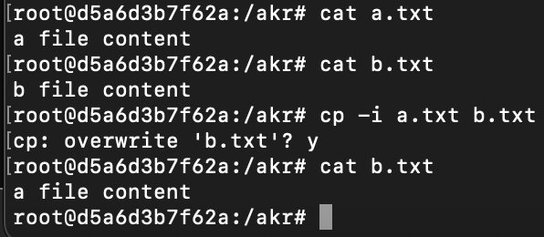
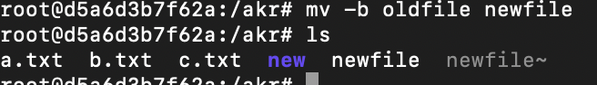
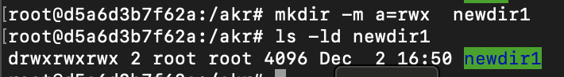
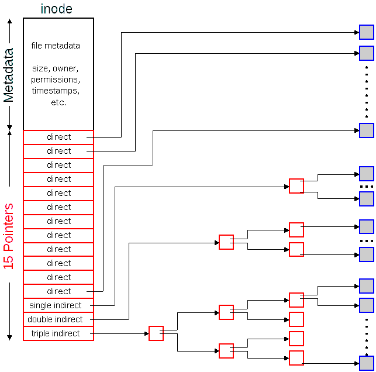
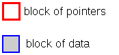
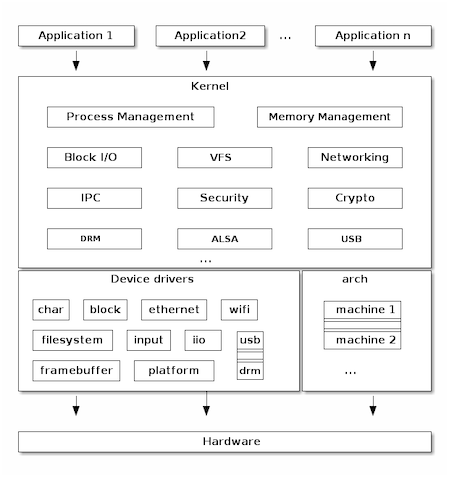
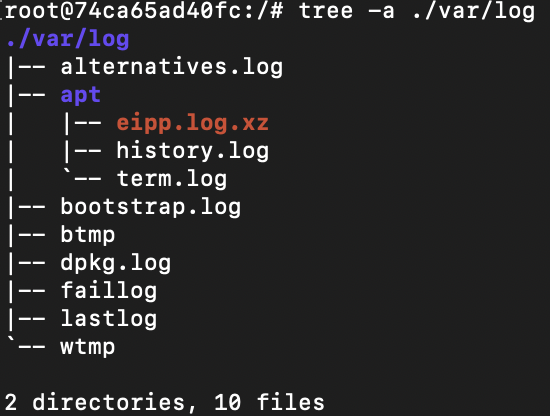
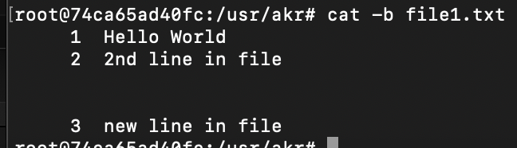
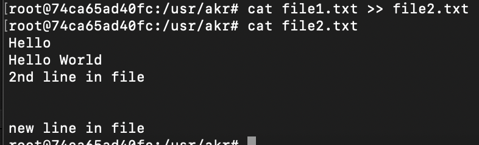
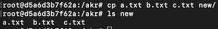

**Operating System Basics:**


- An operating system (OS) is a complex collection of software that acts as the foundation of a computer system, managing all hardware resources and providing a platform for application software to run.
- Acts as a bridge between User &amp; computer hardware
**Operating System architecture :**

In the typical operating system architecture (see the figure below) the operating system kernel is responsible for access and sharing the hardware in a secure and fair manner with multiple applications.


**Responsibilities:**

- Process Management
- manages all running programs (called processes)
- OS coordinates execution of multiple programs simultaneously through -&gt; Scheduling, Multitasking, Process creation &amp; termination, Inter-process communication
- Resource Management
- structured way to store &amp; retrieve data through -&gt; File Organization, Access control, File operations, Different file formats
- software intermediaries -&gt; Device drivers, I/O management, Buffering &amp; catching, Plug &amp; play
- memory management - allocation &amp; deallocation when not needed
- user/group management - User login, permissions, firewalls, encryption


**Linux Architecture:**


┌──────────────────────┐

│           USER APPLICATIONS                                  |

│  (Web browsers, editors, games, etc.)                   │

└──────────────────────┘

↕

┌──────────────────────┐

│         SYSTEM LIBRARIES &amp; UTILITIES                 │

│    (GNU C Library, System Utilities)                       │

└──────────────────────┘

↕

┌──────────────────────┐

│            SYSTEM CALL INTERFACE                       │

│         (Bridge between user/kernel)                         │

└──────────────────────┘

↕

┌──────────────────────┐

│                   LINUX KERNEL                                   │

│  (Core OS - manages hardware &amp; resources)       │

└──────────────────────┘

↕

┌──────────────────────┐

│               HARDWARE LAYER                                │

│     (CPU, RAM, Disk, Network, etc.)                       │

└──────────────────────┘


This architecture makes Linux powerful, flexible, secure, and suitable for everything from embedded devices to supercomputers.

- Linux does not use any source code from Unix. It&#x27;s simply designed to work similarly to the Unix kernel. For that reason, Linux is often described as a *Unix-like* kernel. Linux can be used to run systems that are like Unix, but Linux is not Unix.

**Key Principles:**


- Everything is a file
- Small, focused programs --&gt; Unix philosophy: do one thing well
- Text-based configuration --&gt; human readable config files in /etc
- Hierarchial file system - &gt;single unified tree structure
- Multi - user by design - &gt; strong permission &amp; security model
- Open source
**Main Components of Linux Architecture: **

**Kernel**

- Core part of Linux. Manages hardware, memory, processes, and system calls.
- Types of kernels: monolithic (Linux is monolithic), modular. Examples of kernel tasks: process scheduling, memory management, device drivers.
**Shell**

- Interface between the user and kernel.
- Common shells: bash, zsh, sh, fish.
- It interprets commands entered by users and scripts.
**File System**

- Hierarchical directory structure starting from /. Organizes files, directories, and devices.

**1. Linux Kernel:**

- In the typical operating system architecture (see the figure below) the operating system kernel is responsible for access and sharing the hardware in a secure and fair manner with multiple applications.
- A kernel is a special program responsible for managing the low-level functions of a computer.
- it&#x27;s the kernel that provides the most crucial and most basic functionality at the heart of the operating system by unifying hardware and software.
- The kernel offers a set of APIs that applications issue which are generally referred to as &quot;System Calls&quot;. These APIs are different from regular library APIs because they are the boundary at which the execution mode switch from user mode to kernel mode.
- In order to provide application compatibility, system calls are rarely changed.
- Linux is just one of thousands of kernels in existence.
- The Linux kernel is the kernel used by Linux-based operating systems and the interface between the hardware and the computer processes
- *Linux* used to refer to any operating system that uses Linux as its kernel.
- the term *Linux* can be used to refer specifically to the kernel or to any operating system that uses the Linux kernel in addition to programs from other sources in order to provide a complete operating system.
- Linux kernel uses monolithic kernel architecture. i.e. kernel runs as a single program.

**Features:**

- Resource Management
- Input/Output
- System calls(Process Management)
- Device management
- Memory management
- File system management

**2.Shell**

- Interface between the user and kernel.
- Common shells: bash, zsh, sh, fish.
- It interprets commands entered by users and scripts.
**Shell Functions:**

- **Command execution** - runs programs and utilities
- **Scripting** - automate tasks with shell scripts
- **Job control** - background/foreground processes, process management
- **I/O redirection** - redirect input/output using &gt;, &lt;, |
- **Environment variables** - PATH, HOME, USER, etc.
- **Command history** - recall previous commands
- **Tab completion** - auto-complete file names and commands
- **Wildcards and ****globbing** - *, ?, [] for pattern matching
**Popular Shells:**

- **bash** (Bourne Again Shell) - most common, default on many distributions
- **zsh** (Z Shell) - enhanced features, better customization
- **fish** (Friendly Interactive Shell) - user-friendly, syntax highlighting
- **sh** (Bourne Shell) - original Unix shell, simple and portable
- **csh****/****tcsh** - C-like syntax
- **ksh** (Korn Shell) - combines features of bash and csh
**3.File System**

- **Hierarchical directory structure starting from / (root).**
- **Organizes files, directories, and devices.**
- **&quot;Everything is a file&quot; philosophy** - devices, processes, and sockets are treated as files.
**File System Hierarchy Standard (FHS):**


**File Types:**

- **Regular files** (-) - text, binary, images, etc.
- **Directories** (d) - containers for files
- **Symbolic links** (l) - shortcuts to other files
- **Character devices** (c) - serial devices, terminals
- **Block devices** (b) - hard drives, USB drives
- **Sockets** (s) - inter-process communication
- **Named pipes** (p) - FIFO communication

**File Permissions:**


```bash
 	r - 4 ;  w - 2 ;   x - 1;
```


**Boot Process**

Booting is the process of loading an operating system. It’s the process that starts when we turn on the computer (using the power button or by a software command) and ends when the operating system is loaded into the memory.


1. BIOS/UEFI

↓

2. Bootloader (GRUB2)

↓

3. Kernel Initialization

↓

4. Init System (systemd/init)

↓

5. System Services

↓

6. Login Prompt


- **Running BIOS/UEFI **
- When we turn on the computer, there is no program inside the computer’s main memory (RAM), so the CPU looks for another program, called the  (Basic Input/Output System), and runs it.
- The BIOS is a firmware that is located on the motherboard and is run by the CPU to start the booting sequence:
- First code that runs when computer powers on
- Stored in ROM/Flash memory on motherboard
- Performs POST (Power-On Self Test)
- Checks and initializes hardware components
**     ****UEFI (Unified Extensible Firmware Interface) - Modern System**

- Modern replacement for BIOS
- More advanced and feature-rich
- Supports larger disks (&gt;2TB with GPT)
- Faster boot times
- Graphical interface with mouse support
- **POST (Power-On ****Self Test****):**
After the BIOS starts running, it starts a process called  (Power-On Self-Test) which tests all the hardware devices(CPU, RAM, keyboard, disk drives) and makes sure there are no issues. Moreover, if POST finds some issues in the hardware, the booting process stops and the computer fails to boot.

- **Boot Device Selection:**
- Checks boot order in BIOS settings
- Looks for bootable device (hard drive, USB, CD/DVD, network)
- Reads MBR (Master Boot Record) from boot device
- MBR is first 512 bytes of disk
- Contains bootloader code and partition table
- **Bootloader**
- The bootloader is a small program that loads the operating system kernel into memory.
- After loading the MBR into RAM, the BIOS runs the first instruction loaded from the MBR. The first instruction is typically the bootstrap code, aka the bootloader, which is a program written in machine code that loads the operating system into RAM.
- Each operating system has its own bootloaders. For example, ,  (Linux Loader), and rEFInd are a few popular Linux bootloaders
- **Kernel Initialisation**
- Detect hardware (CPU, RAM, Storage, USB, etc.)
- Load drivers
- Mount **root filesystem temporarily** using initramfs
- Start **PID 1** (first process)
- BUT the kernel cannot directly mount the real filesystem yet — so it uses **initramfs****(Initial RAM ****FileSystem****)**.

- **Init System**
- The init system is the first user-space program (PID 1) that starts all other processes.
- systemd starts as PID 1
- Reads configuration from /etc/systemd/
- Determines boot target (similar to runlevel)
- graphical.target - GUI
- multi-user.target - Multi-user text mode
- rescue.target - Single-user rescue mode
- Starts services in parallel according to dependencies
- Mounts filesystems
- Activates network
- Start display manager (for GUI)
- Start login services

┌──────────────────────┐

│                  USER APPLICATIONS                           │

│     (Firefox, LibreOffice, Games, Text Editors)         │

└──────────────────────┘

↕

┌──────────────────────┐

│                  SYSTEM UTILITIES                               │

```bash
│      (ls, cp, grep, ps, top, bash commands)             │
```

└──────────────────────┘

↕

┌─────────────────────┐

│                       SHELL                                           │

│          (bash, zsh, fish - Command Interpreter)    │

└─────────────────────┘

↕

┌─────────────────────┐

│                  SYSTEM LIBRARIES                          │

│              (glibc, libpthread, libm)                           │

└─────────────────────┘

↕

System Call Interface (SCI)

↕

┌────────────────────────────┐

│                    LINUX KERNEL                                                          │

│  ┌───────┐ ┌──────┐ ┌────────┐  │

│  │  Process          │ │   Memory     │ │    File System       │  │

│  │ Management   │ │ Management│ │    (VFS Layer)       │  │

│  └───────┘ └──────┘ └────────┘  │

│                                                                                                       │

│  ┌─────┐ ┌────┐ ┌──────────┐         │

│  │   Device    │ │  Networ│ │  IPC (Pipes,                 │         │

│  │   Drivers   │  │   Stack  │ │  Signals, Sockets)      │         │

│  └─────┘ └────┘ └──────────┘

└────────────────────────────┘

↕

┌─────────────────────────────┐

│                      HARDWARE                                                              │

│   (CPU, RAM, Hard Disk, Network Card, Peripherals)                    │

└─────────────────────────────┘


```bash
Navigation Commands: ls, cd, pwd, tree
```


```bash
File operations: cat, cp, mv, rm, touch, mkdir
```


```bash
Text processing: grep, find, awk, sed, cut, sort, uniq
```


```bash
awk Built-in variables
```


```bash
cat employee.txt
```

<span style="color:#000000">ajay</span><span style="color:#000000"> manager account 45000</span>

<span style="color:#000000">sunil</span><span style="color:#000000"> </span><span style="color:#000000">clert</span><span style="color:#000000"> account 25000</span>

<span style="color:#000000">varun</span><span style="color:#000000"> manager sales 50000</span>

<span style="color:#000000">amit</span><span style="color:#000000"> manager account 47000</span>

<span style="color:#000000">tarun</span><span style="color:#000000"> peon sales 50000</span>

<span style="color:#000000">deepak</span><span style="color:#000000"> clerk sales 23000</span>

<span style="color:#000000">sunit</span><span style="color:#000000"> peon sales 13000</span>

```bash
awk '{print}' employee.txt 
```

<span style="color:#000000">ajay</span><span style="color:#000000"> manager account 45000</span>

<span style="color:#000000">sunil</span><span style="color:#000000"> </span><span style="color:#000000">clert</span><span style="color:#000000"> account 25000</span>

<span style="color:#000000">varun</span><span style="color:#000000"> manager sales 50000</span>

<span style="color:#000000">amit</span><span style="color:#000000"> manager account 47000</span>

<span style="color:#000000">tarun</span><span style="color:#000000"> peon sales 50000</span>

<span style="color:#000000">deepak</span><span style="color:#000000"> clerk sales 23000</span>

<span style="color:#000000">sunit</span><span style="color:#000000"> peon sales 13000</span>

<span style="color:#000000"># </span><span style="color:#00B050">takes space as field</span><span style="color:#00B050"> </span><span style="color:#00B050">seperator</span>

```bash
awk -F' ' '{print $1,$4}' employee.txt
```

<span style="color:#000000">ajay</span><span style="color:#000000"> 45000</span>

<span style="color:#000000">sunil</span><span style="color:#000000"> 25000</span>

<span style="color:#000000">varun</span><span style="color:#000000"> 50000</span>

<span style="color:#000000">amit</span><span style="color:#000000"> 47000</span>

<span style="color:#000000">tarun</span><span style="color:#000000"> 50000</span>

<span style="color:#000000">deepak</span><span style="color:#000000"> 23000</span>

<span style="color:#000000">sunit</span><span style="color:#000000"> 13000</span>

```bash
awk -F' ' '{print $1, "has salary", $4}' employee.txt
```

<span style="color:#000000">ajay</span><span style="color:#000000"> has salary 45000</span>

<span style="color:#000000">sunil</span><span style="color:#000000"> has salary 25000</span>

<span style="color:#000000">varun</span><span style="color:#000000"> has salary 50000</span>

<span style="color:#000000">amit</span><span style="color:#000000"> has salary 47000</span>

<span style="color:#000000">tarun</span><span style="color:#000000"> has salary 50000</span>

<span style="color:#000000">deepak</span><span style="color:#000000"> has salary 23000</span>

<span style="color:#000000">sunit</span><span style="color:#000000"> has salary 13000</span>

```bash
# define varaibles before awk process begins
```

```bash
awk -v msg="Employee Details:" 'BEGIN {print msg}' employee.txt
```

<span style="color:#000000">Employee Details:</span>

<span style="color:#000000"># </span><span style="color:#00B050">use of variable in condition</span>

```bash
awk -v limit=40000 '$4 > limit {print $1, $4}' employee.txt
```

<span style="color:#000000">ajay</span><span style="color:#000000"> 45000</span>

<span style="color:#000000">varun</span><span style="color:#000000"> 50000</span>

<span style="color:#000000">amit</span><span style="color:#000000"> 47000</span>

<span style="color:#000000">tarun</span><span style="color:#000000"> 50000</span>

<span style="color:#000000"># </span><span style="color:#00B050">search lines with ‘manager’ keyword</span>

```bash
awk '/manager/ {print}' employee.txt
```

<span style="color:#000000">ajay</span><span style="color:#000000"> manager account 45000</span>

<span style="color:#000000">varun</span><span style="color:#000000"> manager sales 50000</span>

<span style="color:#000000">amit</span><span style="color:#000000"> manager account 47000</span>

<span style="color:#000000"># </span><span style="color:#00B050">display line number</span>

```bash
awk '{print NR, $0}' employee.txt
```

<span style="color:#000000">1 </span><span style="color:#000000">ajay</span><span style="color:#000000"> manager account 45000</span>

<span style="color:#000000">2 </span><span style="color:#000000">sunil</span><span style="color:#000000"> </span><span style="color:#000000">clert</span><span style="color:#000000"> account 25000</span>

<span style="color:#000000">3 </span><span style="color:#000000">varun</span><span style="color:#000000"> manager sales 50000</span>

<span style="color:#000000">4 </span><span style="color:#000000">amit</span><span style="color:#000000"> manager account 47000</span>

<span style="color:#000000">5 </span><span style="color:#000000">tarun</span><span style="color:#000000"> peon sales 50000</span>

<span style="color:#000000">6 </span><span style="color:#000000">deepak</span><span style="color:#000000"> clerk sales 23000</span>

<span style="color:#000000">7 </span><span style="color:#000000">sunit</span><span style="color:#000000"> peon sales 13000</span>

<span style="color:#000000"># </span><span style="color:#00B050">NF – display last field</span>

```bash
awk '{print $1, $NF}' employee.txt    
```

<span style="color:#000000">ajay</span><span style="color:#000000"> 45000</span>

<span style="color:#000000">sunil</span><span style="color:#000000"> 25000</span>

<span style="color:#000000">varun</span><span style="color:#000000"> 50000</span>

<span style="color:#000000">amit</span><span style="color:#000000"> 47000</span>

<span style="color:#000000">tarun</span><span style="color:#000000"> 50000</span>

<span style="color:#000000">deepak</span><span style="color:#000000"> 23000</span>

<span style="color:#000000">sunit</span><span style="color:#000000"> 13000</span>

```bash
awk 'NR==3, NR==6 {print NR, $0}' employee.txt
```

<span style="color:#000000">3 </span><span style="color:#000000">varun</span><span style="color:#000000"> manager sales 50000</span>

<span style="color:#000000">4 </span><span style="color:#000000">amit</span><span style="color:#000000"> manager account 47000</span>

<span style="color:#000000">5 </span><span style="color:#000000">tarun</span><span style="color:#000000"> peon sales 50000</span>

<span style="color:#000000">6 </span><span style="color:#000000">deepak</span><span style="color:#000000"> clerk sales 23000</span>

```bash
awk '{print NR "-" $1}' employee.txt 
```

<span style="color:#000000">1-ajay</span>

<span style="color:#000000">2-sunil</span>

<span style="color:#000000">3-varun</span>

<span style="color:#000000">4-amit</span>

<span style="color:#000000">5-tarun</span>

<span style="color:#000000">6-deepak</span>

<span style="color:#000000">7-sunit</span>

```bash
 awk '{ if (length($0) > max) max = length($0) } END { print max }' employee.txt
```

<span style="color:#000000">26</span>

```bash
awk 'END { print NR }' employee.txt
```

<span style="color:#000000">7</span>

<span style="color:#00B050"># </span><span style="color:#00B050">generate</span><span style="color:#00B050"> and print the squares of numbers from 1 to 6.</span>

```bash
awk 'BEGIN { for(i=1;i<=6;i++) print "square of", i, "is",i*i; }' 
```

<span style="color:#000000">square of 1 is 1</span>

<span style="color:#000000">square of 2 is 4</span>

<span style="color:#000000">square of 3 is 9</span>

<span style="color:#000000">square of 4 is 16</span>

<span style="color:#000000">square of 5 is 25</span>

<span style="color:#000000">square of 6 is 36</span>


```bash
sed
```


The sed command in Linux, short for stream editor, is a non-interactive text editor used to perform basic text transformations on an input stream, such as a file or input from a pipeline. It processes text line by line, applying the editing commands you specify.


```bash
cat sample.txt
```

<span style="color:#000000">unix is great os. unix is opensource. unix is free os.</span>

<span style="color:#000000">learn operating system.</span>

<span style="color:#000000">unix linux which one you choose.</span>

<span style="color:#000000">unix is easy to learn.unix is a multiuser os.Learn unix .unix is </span><span style="color:#000000">a powerful</span><span style="color:#000000">.</span>


<span style="color:#00B050"># replacing a string</span>

```bash
sed 's/unix/linux/' sample.txt
```

<u>linux</u><span style="color:#000000"> is great os. unix is opensource. unix is free os.</span>

<span style="color:#000000">learn operating system.</span>

<span style="color:#000000">linux </span><span style="color:#000000">linux</span><span style="color:#000000"> which one you choose.</span>

<span style="color:#000000">linux is easy to learn.unix is a multiuser os.Learn unix .unix is </span><span style="color:#000000">a powerful</span><span style="color:#000000">.</span>


<span style="color:#00B050"># replacing nth </span><span style="color:#00B050">occurance</span><span style="color:#00B050"> of a pattern in a line</span>

```bash
sed 's/unix/linux/2' sample.txt
```

<span style="color:#000000">unix is great os. linux is opensource. unix is free os.</span>

<span style="color:#000000">learn operating system.</span>

<span style="color:#000000">unix linux which one you choose.</span>

<span style="color:#000000">unix is easy to learn.linux is a multiuser os.Learn unix .unix is </span><span style="color:#000000">a powerful</span><span style="color:#000000">.</span>


<span style="color:#00B050"># replacing all the </span><span style="color:#00B050">occurances</span><span style="color:#00B050"> of the pattern in a line</span>

```bash
sed 's/unix/linux/g' sample.txt
```

<span style="color:#000000">linux is great os. linux is opensource. linux is free os.</span>

<span style="color:#000000">learn operating system.</span>

<span style="color:#000000">linux linux which one you choose.</span>

<span style="color:#000000">linux is easy to learn.linux is a multiuser os.Learn linux .linux is </span><span style="color:#000000">a powerful</span><span style="color:#000000">.</span>


<span style="color:#00B050">#Replacing from nth </span><span style="color:#00B050">Occurance</span><span style="color:#00B050"> to all Occurances in a line</span>

```bash
sed 's/linux/unix/3g' sample.txt
```

<span style="color:#000000">unix is great os. unix is opensource. unix is free os.</span>

<span style="color:#000000">learn operating system.</span>

<span style="color:#000000">unix linux which one you choose.</span>

<span style="color:#000000">unix is easy to learn.unix is a multiuser os.Learn unix .unix is </span><span style="color:#000000">a powerful</span><span style="color:#000000">.</span>


<span style="color:#00B050"># Parenthesize First Character of each word</span>

```bash
echo "Welcome To The Linux World" | sed 's/\(\b[A-Z]\)/\(\1\)/g'
```

<span style="color:#000000">(W)</span><span style="color:#000000">elcome</span><span style="color:#000000"> (T)o (T)he (L)</span><span style="color:#000000">inux</span><span style="color:#000000"> (W)</span><span style="color:#000000">orld</span>


<span style="color:#00B050">#Replacing String on a Range of lines</span>

```bash
sed '1,3 s/unix/linux/' sample.txt
```

<span style="color:#000000">linux is great os. unix is opensource. unix is free os.</span>

<span style="color:#000000">learn operating system.</span>

<span style="color:#000000">linux linux which one you choose.</span>

<span style="color:#000000">unix is easy to learn.unix is a multiuser os.Learn unix .unix is </span><span style="color:#000000">a powerful</span><span style="color:#000000">.</span>


<span style="color:#00B050">Delete lines from a file</span>

```bash
sed '5d' sample.txt  # delete 5th line
```

```bash
sed '3,6d' sample.txt  # delete line from range
```

```bash
sed '12,$d' sample.txt  # delete from nth to last line
```

```bash
sed '/pattern/d' sample.txt  # delete pattern matching line
```


**cut**


```bash
cat states.txt
```

<span style="color:#000000">Andhra Pradesh Amaravati</span>

<span style="color:#000000">Assam Dispur</span>

<span style="color:#000000">Bihar </span><span style="color:#000000">patna</span>

<span style="color:#000000">Telangana Hyderabad</span>

<span style="color:#000000">Kerala </span><span style="color:#000000">trivandram</span>

<span style="color:#000000">Rajastan</span><span style="color:#000000"> Jaipur</span>

<span style="color:#000000">Gujarat </span><span style="color:#000000">GandhiNager</span>

<span style="color:#00B050">#</span><span style="color:#00B050">extract 2</span><span style="color:#00B050">nd</span><span style="color:#00B050"> &amp; 3</span><span style="color:#00B050">rd</span><span style="color:#00B050"> fields from each line</span>

<span style="color:#000000">cut -d &quot; &quot; -f 2,3 states.txt</span>

<span style="color:#000000">Pradesh Amaravati</span>

<span style="color:#000000">Dispur</span>

<span style="color:#000000">patna</span>

<span style="color:#000000">Hyderabad</span>

<span style="color:#000000">trivandram</span>

<span style="color:#000000">Jaipur</span>

<span style="color:#000000">GandhiNager</span>


<span style="color:#00B050">#extract 1st,2nd &amp; 3rd bytes from each line</span>

<span style="color:#000000">cut -b</span><span style="color:#000000"> 1,2,3 states.txt</span>

<span style="color:#000000">And</span>

<span style="color:#000000">Ass</span>

<span style="color:#000000">Bih</span>

<span style="color:#000000">Tel</span>

<span style="color:#000000">Ker</span>

<span style="color:#000000">Raj</span>

<span style="color:#000000">Guj</span>

<span style="color:#00B050">#extract list with ranges</span>

<span style="color:#000000">cut -b 1-3,5-7 states.txt</span>

<span style="color:#000000">Andra </span>

<span style="color:#000000">Assm</span><span style="color:#000000"> D</span>

<span style="color:#000000">Bihr p</span>

<span style="color:#000000">Telnga</span>

<span style="color:#000000">Kerla </span>

<span style="color:#000000">Rajsta</span>

<span style="color:#000000">Gujrat</span>


<span style="color:#00B050">#</span><span style="color:#00B050">select</span><span style="color:#00B050"> bytes from begin to end</span>

<span style="color:#000000">cut -b 1- states.txt</span>

<span style="color:#000000">Andhra Pradesh Amaravati</span>

<span style="color:#000000">Assam Dispur</span>

<span style="color:#000000">Bihar </span><span style="color:#000000">patna</span>

<span style="color:#000000">Telangana Hyderabad</span>

<span style="color:#000000">Kerala </span><span style="color:#000000">trivandram</span>

<span style="color:#000000">Rajastan</span><span style="color:#000000"> Jaipur</span>

<span style="color:#000000">Gujarat </span><span style="color:#000000">GandhiNager</span>


<span style="color:#000000">#</span><span style="color:#00B050">Cut by character</span>

<span style="color:#000000">cut -c</span><span style="color:#000000"> 2,5,7 states.txt</span>

<span style="color:#000000">nr </span>

<span style="color:#000000">smD</span>

<span style="color:#000000">irp</span>

<span style="color:#000000">ena</span>

<span style="color:#000000">el</span><span style="color:#000000"> </span>

<span style="color:#000000">asa</span>

<span style="color:#000000">urt</span>

<span style="color:#000000">cut -c</span><span style="color:#000000"> 1-7 states.txt</span>

<span style="color:#000000">Andhra </span>

<span style="color:#000000">Assam D</span>

<span style="color:#000000">Bihar p</span>

<span style="color:#000000">Telanga</span>

<span style="color:#000000">Kerala </span>

<span style="color:#000000">Rajasta</span>

<span style="color:#000000">Gujarat</span>


<span style="color:#00B050"># # select characters from begin to end</span>

<span style="color:#000000">cut -c 1- states.txt</span>

<span style="color:#000000">Andhra Pradesh Amaravati</span>

<span style="color:#000000">Assam Dispur</span>

<span style="color:#000000">Bihar </span><span style="color:#000000">patna</span>

<span style="color:#000000">Telangana Hyderabad</span>

<span style="color:#000000">Kerala </span><span style="color:#000000">trivandram</span>

<span style="color:#000000">Rajastan</span><span style="color:#000000"> Jaipur</span>

<span style="color:#000000">Gujarat </span><span style="color:#000000">GandhiNager</span>


<span style="color:#00B050"># print from starting to 5th character</span>

<span style="color:#000000">cut -c</span><span style="color:#000000"> -5 states.txt</span>

<span style="color:#000000">Andhr</span>

<span style="color:#000000">Assam</span>

<span style="color:#000000">Bihar</span>

<span style="color:#000000">Telan</span>

<span style="color:#000000">Keral</span>

<span style="color:#000000">Rajas</span>

<span style="color:#000000">Gujar</span>

**Pipes and redirection: |, &gt;, &gt;&gt;, &lt;, 2&gt;&amp;1**

```bash
ls
```

<span style="color:#000000">a.txt  c.txt  employee.txt  </span>**new**<span style="color:#000000">     </span><span style="color:#0000A3">newdir1</span><span style="color:#000000">  </span><span style="color:#7D7D7D">newfile~</span><span style="color:#000000">     sample.txt</span>

<span style="color:#000000">b.txt  </span><span style="color:#0000A3">dir1</span><span style="color:#000000">   file1.txt     </span><span style="color:#0000A3">newdir</span><span style="color:#000000">  newfile  pattern.txt  states.txt</span>


```bash
ls |wc -l
```

<span style="color:#000000">14</span>


```bash
# cat sample.txt |wc -l
```

<span style="color:#000000">4</span>


```bash
# cat sample.txt |grep "linux"
```

<span style="color:#000000">unix </span>**linux**<span style="color:#000000"> which one you choose.</span>

```bash
cat sample.txt
```

<span style="color:#000000">unix is great os. unix is opensource. unix is free os.</span>

<span style="color:#000000">learn operating system.</span>

<span style="color:#000000">unix linux which one you choose.</span>

<span style="color:#000000">unix is easy to learn.unix is a multiuser os.Learn unix .unix is </span><span style="color:#000000">a powerful</span><span style="color:#000000">.</span>


```bash
 cat sample.txt |grep "unix" 
```

**unix**<span style="color:#000000"> is great os. </span>**unix**<span style="color:#000000"> is opensource. </span>**unix**<span style="color:#000000"> is free os.</span>

**unix**<span style="color:#000000"> linux which one you choose.</span>

**unix**<span style="color:#000000"> is easy to learn.</span>**unix**<span style="color:#000000"> is a multiuser os.Learn </span>**unix**<span style="color:#000000"> .</span>**unix**<span style="color:#000000"> is </span><span style="color:#000000">a powerful</span><span style="color:#000000">.</span>


<span style="color:#000000"># </span><span style="color:#00B050">save</span><span style="color:#00B050"> output to a file</span>

```bash
ls > output.txt
```

```bash
cat output.txt
```

<span style="color:#000000">a.txt</span>

<span style="color:#000000">b.txt</span>

<span style="color:#000000">c.txt</span>

<span style="color:#000000">dir1</span>

<span style="color:#000000">employee.txt</span>

<span style="color:#000000">file1.txt</span>

<span style="color:#000000">new</span>

<span style="color:#000000">newdir</span>

<span style="color:#000000">newdir1</span>

<span style="color:#000000">newfile</span>

<span style="color:#000000">newfile~</span>

<span style="color:#000000">output.txt</span>

<span style="color:#000000">pattern.txt</span>

<span style="color:#000000">sample.txt</span>

<span style="color:#000000">states.txt</span>


<span style="color:#000000">date &gt; b.txt</span>

```bash
cat b.txt
```

<span style="color:#000000">Tue Dec  2 23:53:13 +04 2025</span>


<span style="color:#000000">echo &quot;new entry&quot; &gt;&gt; b.txt</span>

```bash
cat b.txt
```

<span style="color:#000000">Tue Dec  2 23:53:13 +04 2025</span>

<span style="color:#000000">new entry</span>

```bash
cat < a.txt
```

<span style="color:#000000">a file content</span>

<span style="color:#000000">sort states.txt</span>

<span style="color:#000000">Andhra Pradesh Amaravati</span>

<span style="color:#000000">Assam Dispur</span>

<span style="color:#000000">Bihar </span><span style="color:#000000">patna</span>

<span style="color:#000000">Gujarat </span><span style="color:#000000">GandhiNager</span>

<span style="color:#000000">Kerala </span><span style="color:#000000">trivandram</span>

<span style="color:#000000">Rajastan</span><span style="color:#000000"> Jaipur</span>

<span style="color:#000000">Telangana Hyderabad</span>


<span style="color:#000000">sort &lt; states.txt</span>

<span style="color:#000000">Andhra Pradesh Amaravati</span>

<span style="color:#000000">Assam Dispur</span>

<span style="color:#000000">Bihar </span><span style="color:#000000">patna</span>

<span style="color:#000000">Gujarat </span><span style="color:#000000">GandhiNager</span>

<span style="color:#000000">Kerala </span><span style="color:#000000">trivandram</span>

<span style="color:#000000">Rajastan</span><span style="color:#000000"> Jaipur</span>

<span style="color:#000000">Telangana Hyderabad</span>


```bash
ls /fackepath 2> errors.txt
```

```bash
cat errors.txt
```

```bash
ls: cannot access '/fackepath': No such file or directory
```


<span style="color:#000000">touch dir1/f1.txt dir1/f2.txt</span><span style="color:#000000"> </span>

```bash
ls /dir1 /fakepath > output.txt 2>&1
```

```bash
cat output.txt
```

```bash
ls: cannot access '/dir1': No such file or directory
```

```bash
ls: cannot access '/fakepath': No such file or directory
```


```bash
ls dir1 /fakepath >> output.txt 2>&1
```


```bash
cat output.txt
```

```bash
ls: cannot access '/dir1': No such file or directory
```

```bash
ls: cannot access '/fakepath': No such file or directory
```

```bash
ls: cannot access '/fakepath': No such file or directory
```

<span style="color:#000000">dir1:</span>

<span style="color:#000000">f1.txt</span>

<span style="color:#000000">f2.txt</span>


```bash
cat employee.txt      
```

<span style="color:#000000">ajay</span><span style="color:#000000"> manager account 45000</span>

<span style="color:#000000">sunil</span><span style="color:#000000"> </span><span style="color:#000000">clert</span><span style="color:#000000"> account 25000</span>

<span style="color:#000000">varun</span><span style="color:#000000"> manager sales 50000</span>

<span style="color:#000000">amit</span><span style="color:#000000"> manager account 47000</span>

<span style="color:#000000">tarun</span><span style="color:#000000"> peon sales 50000</span>

<span style="color:#000000">deepak</span><span style="color:#000000"> clerk sales 23000</span>

<span style="color:#000000">sunit</span><span style="color:#000000"> peon sales 13000</span>


<span style="color:#000000">sort&lt; employee.txt &gt;&gt; sorted.txt</span><span style="color:#000000"> </span>

```bash
cat sorted.txt
```

<span style="color:#000000">ajay</span><span style="color:#000000"> manager account 45000</span>

<span style="color:#000000">amit</span><span style="color:#000000"> manager account 47000</span>

<span style="color:#000000">deepak</span><span style="color:#000000"> clerk sales 23000</span>

<span style="color:#000000">sunil</span><span style="color:#000000"> </span><span style="color:#000000">clert</span><span style="color:#000000"> account 25000</span>

<span style="color:#000000">sunit</span><span style="color:#000000"> peon sales 13000</span>

<span style="color:#000000">tarun</span><span style="color:#000000"> peon sales 50000</span>

<span style="color:#000000">varun</span><span style="color:#000000"> manager sales 50000</span>


<span style="color:#000000">#Print file sorted, remove blank lines &amp; format</span>

```bash
cat states.txt| sed '/^$/d' |sort | nl
```

```bash
     1	Andhra Pradesh Amaravati
```

```bash
     2	Assam Dispur
```

```bash
     3	Bihar patna
```

```bash
     4	Gujarat GandhiNager
```

```bash
     5	Kerala trivandram
```

```bash
     6	Rajastan Jaipur
```

```bash
     7	Telangana Hyderabad
```

```bash
cat states.txt| sed '/^ $/d' |sort | nl
```

```bash
     1	Andhra Pradesh Amaravati
```

```bash
     2	Assam Dispur
```

```bash
     3	Bihar patna
```

```bash
     4	Gujarat GandhiNager
```

```bash
     5	Kerala trivandram
```

```bash
     6	Rajastan Jaipur
```

```bash
     7	Telangana Hyderabad
```

```bash
cat states.txt| sed '/^' '$/d' |sort | nl
```

```bash
sed: -e expression #1, char 2: unterminated address regex
```

```bash
cat notes.txt | sed '/^$/d' | sort | nl                       
```

```bash
cat: notes.txt: No such file or directory
```


```bash
cat states.txt | sed '/^$/d' | sort | nl
```

```bash
     1	Andhra Pradesh Amaravati
```

```bash
     2	Assam Dispur
```

```bash
     3	Bihar patna
```

```bash
     4	Gujarat GandhiNager
```

```bash
     5	Kerala trivandram
```

```bash
     6	Rajastan Jaipur
```

```bash
     7	Telangana Hyderabad
```


```bash
cat states.txt | sed '/^$/d' | sort     
```

<span style="color:#000000">Andhra Pradesh Amaravati</span>

<span style="color:#000000">Assam Dispur</span>

<span style="color:#000000">Bihar </span><span style="color:#000000">patna</span>

<span style="color:#000000">Gujarat </span><span style="color:#000000">GandhiNager</span>

<span style="color:#000000">Kerala </span><span style="color:#000000">trivandram</span>

<span style="color:#000000">Rajastan</span><span style="color:#000000"> Jaipur</span>

<span style="color:#000000">Telangana Hyderabad</span>


```bash
cat states.txt | sed '/^$/d' | sort |ln
```

<span style="color:#000000">ln: missing file operand</span>

<span style="color:#000000">Try &#x27;ln --help&#x27; for more information.</span>

```bash
cat states.txt | sed '/^$/d' | sort | nl
```

```bash
     1	Andhra Pradesh Amaravati
```

```bash
     2	Assam Dispur
```

```bash
     3	Bihar patna
```

```bash
     4	Gujarat GandhiNager
```

```bash
     5	Kerala trivandram
```

```bash
     6	Rajastan Jaipur
```

```bash
     7	Telangana Hyderabad
```

```bash
ls
```

<span style="color:#000000">a.txt  bash_users.txt  </span><span style="color:#0000A3">dir1</span><span style="color:#000000">          errors.txt  </span>**new**<span style="color:#000000">     </span><span style="color:#0000A3">newdir1</span><span style="color:#000000">  </span><span style="color:#7D7D7D">newfile~</span><span style="color:#000000">    pattern.txt  sorted.txt</span>

<span style="color:#000000">b.txt  c.txt           employee.txt  file1.txt   </span><span style="color:#0000A3">newdir</span><span style="color:#000000">  newfile  output.txt  sample.txt   states.txt</span>


```bash
cat file1.txt
```

<span style="color:#000000">unix Operating system</span>

<span style="color:#000000">hello </span><span style="color:#000000">dp</span><span style="color:#000000"> world</span>

<span style="color:#000000">UNIX vs linux</span>

<span style="color:#000000">working on linux commands</span>

<span style="color:#000000">vim file1.txt</span>

```bash
cat file1.txt
```


<span style="color:#000000">unix Operating system</span>


<span style="color:#000000">hello </span><span style="color:#000000">dp</span><span style="color:#000000"> world</span>


<span style="color:#000000">UNIX vs linux</span>


<span style="color:#000000">working on linux commands</span>


```bash
cat file1.txt | sed '/^$/d' | sort | nl
```

```bash
     1	UNIX vs linux
```

```bash
     2	hello dp world
```

```bash
     3	unix Operating system
```

```bash
     4	working on linux commands
```


```bash
ls -lah
```

<span style="color:#000000">total 72K</span>

<span style="color:#000000">drwxr-xr-x 6 root </span><span style="color:#000000">root</span><span style="color:#000000"> 4.0K Dec  3 00:09 </span>**.**

<span style="color:#000000">drwxr-xr-x 1 root </span><span style="color:#000000">root</span><span style="color:#000000"> 4.0K Dec  2 20:14</span><span style="color:#000000"> </span>**..**

- <span style="color:#000000">-rw-r--r-- 1 root </span><span style="color:#000000">root</span><span style="color:#000000">   15 Dec  2 20:21 a.txt</span>
- <span style="color:#000000">-rw-r--r-- 1 root </span><span style="color:#000000">root</span><span style="color:#000000">   39 Dec  2 23:53 b.txt</span>
- <span style="color:#000000">-rw-r--r-- 1 root </span><span style="color:#000000">root</span><span style="color:#000000">   12 Dec  3 00:02 bash_users.txt</span>
- <span style="color:#000000">-rw-r--r-- 1 root </span><span style="color:#000000">root</span><span style="color:#000000">   15 Dec  2 20:21 c.txt</span>
<span style="color:#000000">drwxrwxrwx 2 root </span><span style="color:#000000">root</span><span style="color:#000000"> 4.0K Dec  2 23:57 </span><span style="color:#0000A3">dir1</span>

- <span style="color:#000000">-rw-r--r-- 1 root </span><span style="color:#000000">root</span><span style="color:#000000">  177 Dec  2 21:52 employee.txt</span>
- <span style="color:#000000">-rw-r--r-- 1 root </span><span style="color:#000000">root</span><span style="color:#000000">   58 Dec  2 23:55 errors.txt</span>
- <span style="color:#000000">-rw-r--r-- 1 root </span><span style="color:#000000">root</span><span style="color:#000000">   79 Dec  3 00:09 file1.txt</span>
<span style="color:#000000">drwxr-xr-x 2 root </span><span style="color:#000000">root</span><span style="color:#000000"> 4.0K Dec  2 20:16 </span>**new**

<span style="color:#000000">drwxrwxrwx 2 root </span><span style="color:#000000">root</span><span style="color:#000000"> 4.0K Dec  2 20:48 </span><span style="color:#0000A3">newdir</span>

<span style="color:#000000">drwxrwxrwx 2 root </span><span style="color:#000000">root</span><span style="color:#000000"> 4.0K Dec  2 20:50 </span><span style="color:#0000A3">newdir1</span>

- <span style="color:#000000">-rw-r--r-- 1 root </span><span style="color:#000000">root</span><span style="color:#000000">    0 Dec  2 20:35 newfile</span>
- <span style="color:#000000">-rw-r--r-- 1 root </span><span style="color:#000000">root</span><span style="color:#000000">    0 Dec  2 20:35 </span><span style="color:#7D7D7D">newfile~</span>
- <span style="color:#000000">-rw-r--r-- 1 root </span><span style="color:#000000">root</span><span style="color:#000000">  187 Dec  2 23:58 output.txt</span>
- <span style="color:#000000">-rw-r--r-- 1 root </span><span style="color:#000000">root</span><span style="color:#000000">   16 Dec  2 21:39 pattern.txt</span>
- <span style="color:#000000">-rw-r--r-- 1 root </span><span style="color:#000000">root</span><span style="color:#000000">  189 Dec  2 22:45 sample.txt</span>
- <span style="color:#000000">-rw-r--r-- 1 root </span><span style="color:#000000">root</span><span style="color:#000000">  177 Dec  3 00:01 sorted.txt</span>
- <span style="color:#000000">-rw-r--r-- 1 root </span><span style="color:#000000">root</span><span style="color:#000000">  124 Dec  2 23:16 states.txt</span>
```bash
ls -lah | sort
```

- <span style="color:#000000">-rw-r--r-- 1 root </span><span style="color:#000000">root</span><span style="color:#000000">    0 Dec  2 20:35 newfile</span>
- <span style="color:#000000">-rw-r--r-- 1 root </span><span style="color:#000000">root</span><span style="color:#000000">    0 Dec  2 20:35 newfile~</span>
- <span style="color:#000000">-rw-r--r-- 1 root </span><span style="color:#000000">root</span><span style="color:#000000">   12 Dec  3 00:02 bash_users.txt</span>
- <span style="color:#000000">-rw-r--r-- 1 root </span><span style="color:#000000">root</span><span style="color:#000000">   15 Dec  2 20:21 a.txt</span>
- <span style="color:#000000">-rw-r--r-- 1 root </span><span style="color:#000000">root</span><span style="color:#000000">   15 Dec  2 20:21 c.txt</span>
- <span style="color:#000000">-rw-r--r-- 1 root </span><span style="color:#000000">root</span><span style="color:#000000">   16 Dec  2 21:39 pattern.txt</span>
- <span style="color:#000000">-rw-r--r-- 1 root </span><span style="color:#000000">root</span><span style="color:#000000">   39 Dec  2 23:53 b.txt</span>
- <span style="color:#000000">-rw-r--r-- 1 root </span><span style="color:#000000">root</span><span style="color:#000000">   58 Dec  2 23:55 errors.txt</span>
- <span style="color:#000000">-rw-r--r-- 1 root </span><span style="color:#000000">root</span><span style="color:#000000">   79 Dec  3 00:09 file1.txt</span>
- <span style="color:#000000">-rw-r--r-- 1 root </span><span style="color:#000000">root</span><span style="color:#000000">  124 Dec  2 23:16 states.txt</span>
- <span style="color:#000000">-rw-r--r-- 1 root </span><span style="color:#000000">root</span><span style="color:#000000">  177 Dec  2 21:52 employee.txt</span>
- <span style="color:#000000">-rw-r--r-- 1 root </span><span style="color:#000000">root</span><span style="color:#000000">  177 Dec  3 00:01 sorted.txt</span>
- <span style="color:#000000">-rw-r--r-- 1 root </span><span style="color:#000000">root</span><span style="color:#000000">  187 Dec  2 23:58 output.txt</span>
- <span style="color:#000000">-rw-r--r-- 1 root </span><span style="color:#000000">root</span><span style="color:#000000">  189 Dec  2 22:45 sample.txt</span>
<span style="color:#000000">drwxr-xr-x 1 root </span><span style="color:#000000">root</span><span style="color:#000000"> 4.0K Dec  2 20:14</span><span style="color:#000000"> ..</span>

<span style="color:#000000">drwxr-xr-x 2 root </span><span style="color:#000000">root</span><span style="color:#000000"> 4.0K Dec  2 20:16 new</span>

<span style="color:#000000">drwxr-xr-x 6 root </span><span style="color:#000000">root</span><span style="color:#000000"> 4.0K Dec  3 00:09 .</span>

<span style="color:#000000">drwxrwxrwx 2 root </span><span style="color:#000000">root</span><span style="color:#000000"> 4.0K Dec  2 20:48 </span><span style="color:#000000">newdir</span>

<span style="color:#000000">drwxrwxrwx 2 root </span><span style="color:#000000">root</span><span style="color:#000000"> 4.0K Dec  2 20:50 newdir1</span>

<span style="color:#000000">drwxrwxrwx 2 root </span><span style="color:#000000">root</span><span style="color:#000000"> 4.0K Dec  2 23:57 dir1</span>

<span style="color:#000000">total 72K</span>

```bash
ls -lSh       
```

<span style="color:#000000">total 64K</span>

<span style="color:#000000">drwxrwxrwx 2 root </span><span style="color:#000000">root</span><span style="color:#000000"> 4.0K Dec  2 23:57 </span><span style="color:#0000A3">dir1</span>

<span style="color:#000000">drwxr-xr-x 2 root </span><span style="color:#000000">root</span><span style="color:#000000"> 4.0K Dec  2 20:16 </span>**new**

<span style="color:#000000">drwxrwxrwx 2 root </span><span style="color:#000000">root</span><span style="color:#000000"> 4.0K Dec  2 20:48 </span><span style="color:#0000A3">newdir</span>

<span style="color:#000000">drwxrwxrwx 2 root </span><span style="color:#000000">root</span><span style="color:#000000"> 4.0K Dec  2 20:50 </span><span style="color:#0000A3">newdir1</span>

- <span style="color:#000000">-rw-r--r-- 1 root </span><span style="color:#000000">root</span><span style="color:#000000">  189 Dec  2 22:45 sample.txt</span>
- <span style="color:#000000">-rw-r--r-- 1 root </span><span style="color:#000000">root</span><span style="color:#000000">  187 Dec  2 23:58 output.txt</span>
- <span style="color:#000000">-rw-r--r-- 1 root </span><span style="color:#000000">root</span><span style="color:#000000">  177 Dec  2 21:52 employee.txt</span>
- <span style="color:#000000">-rw-r--r-- 1 root </span><span style="color:#000000">root</span><span style="color:#000000">  177 Dec  3 00:01 sorted.txt</span>
- <span style="color:#000000">-rw-r--r-- 1 root </span><span style="color:#000000">root</span><span style="color:#000000">  124 Dec  2 23:16 states.txt</span>
- <span style="color:#000000">-rw-r--r-- 1 root </span><span style="color:#000000">root</span><span style="color:#000000">   79 Dec  3 00:09 file1.txt</span>
- <span style="color:#000000">-rw-r--r-- 1 root </span><span style="color:#000000">root</span><span style="color:#000000">   58 Dec  2 23:55 errors.txt</span>
- <span style="color:#000000">-rw-r--r-- 1 root </span><span style="color:#000000">root</span><span style="color:#000000">   39 Dec  2 23:53 b.txt</span>
- <span style="color:#000000">-rw-r--r-- 1 root </span><span style="color:#000000">root</span><span style="color:#000000">   16 Dec  2 21:39 pattern.txt</span>
- <span style="color:#000000">-rw-r--r-- 1 root </span><span style="color:#000000">root</span><span style="color:#000000">   15 Dec  2 20:21 a.txt</span>
- <span style="color:#000000">-rw-r--r-- 1 root </span><span style="color:#000000">root</span><span style="color:#000000">   15 Dec  2 20:21 c.txt</span>
- <span style="color:#000000">-rw-r--r-- 1 root </span><span style="color:#000000">root</span><span style="color:#000000">   12 Dec  3 00:02 bash_users.txt</span>
- <span style="color:#000000">-rw-r--r-- 1 root </span><span style="color:#000000">root</span><span style="color:#000000">    0 Dec  2 20:35 newfile</span>
- <span style="color:#000000">-rw-r--r-- 1 root </span><span style="color:#000000">root</span><span style="color:#000000">    0 Dec  2 20:35 </span><span style="color:#7D7D7D">newfile~</span>
```bash
ls -lsh
```

<span style="color:#000000">total 64K</span>

<span style="color:#000000">4.0K -rw-r--r-- 1 root </span><span style="color:#000000">root</span><span style="color:#000000">   15 Dec  2 20:21 a.txt</span>

<span style="color:#000000">4.0K -rw-r--r-- 1 root </span><span style="color:#000000">root</span><span style="color:#000000">   39 Dec  2 23:53 b.txt</span>

<span style="color:#000000">4.0K -rw-r--r-- 1 root </span><span style="color:#000000">root</span><span style="color:#000000">   12 Dec  3 00:02 bash_users.txt</span>

<span style="color:#000000">4.0K -rw-r--r-- 1 root </span><span style="color:#000000">root</span><span style="color:#000000">   15 Dec  2 20:21 c.txt</span>

<span style="color:#000000">4.0K drwxrwxrwx 2 root </span><span style="color:#000000">root</span><span style="color:#000000"> 4.0K Dec  2 23:57 </span><span style="color:#0000A3">dir1</span>

<span style="color:#000000">4.0K -rw-r--r-- 1 root </span><span style="color:#000000">root</span><span style="color:#000000">  177 Dec  2 21:52 employee.txt</span>

<span style="color:#000000">4.0K -rw-r--r-- 1 root </span><span style="color:#000000">root</span><span style="color:#000000">   58 Dec  2 23:55 errors.txt</span>

<span style="color:#000000">4.0K -rw-r--r-- 1 root </span><span style="color:#000000">root</span><span style="color:#000000">   79 Dec  3 00:09 file1.txt</span>

<span style="color:#000000">4.0K drwxr-xr-x 2 root </span><span style="color:#000000">root</span><span style="color:#000000"> 4.0K Dec  2 20:16 </span>**new**

<span style="color:#000000">4.0K drwxrwxrwx 2 root </span><span style="color:#000000">root</span><span style="color:#000000"> 4.0K Dec  2 20:48 </span><span style="color:#0000A3">newdir</span>

<span style="color:#000000">4.0K drwxrwxrwx 2 root </span><span style="color:#000000">root</span><span style="color:#000000"> 4.0K Dec  2 20:50 </span><span style="color:#0000A3">newdir1</span>

<span style="color:#000000">   0 -rw-r--r-- 1 root </span><span style="color:#000000">root</span><span style="color:#000000">    0 Dec  2 20:35 newfile</span>

<span style="color:#000000">   0 -rw-r--r-- 1 root </span><span style="color:#000000">root</span><span style="color:#000000">    0 Dec  2 20:35 </span><span style="color:#7D7D7D">newfile~</span>

<span style="color:#000000">4.0K -rw-r--r-- 1 root </span><span style="color:#000000">root</span><span style="color:#000000">  187 Dec  2 23:58 output.txt</span>

<span style="color:#000000">4.0K -rw-r--r-- 1 root </span><span style="color:#000000">root</span><span style="color:#000000">   16 Dec  2 21:39 pattern.txt</span>

<span style="color:#000000">4.0K -rw-r--r-- 1 root </span><span style="color:#000000">root</span><span style="color:#000000">  189 Dec  2 22:45 sample.txt</span>

<span style="color:#000000">4.0K -rw-r--r-- 1 root </span><span style="color:#000000">root</span><span style="color:#000000">  177 Dec  3 00:01 sorted.txt</span>

<span style="color:#000000">4.0K -rw-r--r-- 1 root </span><span style="color:#000000">root</span><span style="color:#000000">  124 Dec  2 23:16 states.txt</span>

```bash
ls -lSh
```

<span style="color:#000000">total 64K</span>

<span style="color:#000000">drwxrwxrwx 2 root </span><span style="color:#000000">root</span><span style="color:#000000"> 4.0K Dec  2 23:57 </span><span style="color:#0000A3">dir1</span>

<span style="color:#000000">drwxr-xr-x 2 root </span><span style="color:#000000">root</span><span style="color:#000000"> 4.0K Dec  2 20:16 </span>**new**

<span style="color:#000000">drwxrwxrwx 2 root </span><span style="color:#000000">root</span><span style="color:#000000"> 4.0K Dec  2 20:48 </span><span style="color:#0000A3">newdir</span>

<span style="color:#000000">drwxrwxrwx 2 root </span><span style="color:#000000">root</span><span style="color:#000000"> 4.0K Dec  2 20:50 </span><span style="color:#0000A3">newdir1</span>

- <span style="color:#000000">-rw-r--r-- 1 root </span><span style="color:#000000">root</span><span style="color:#000000">  189 Dec  2 22:45 sample.txt</span>
- <span style="color:#000000">-rw-r--r-- 1 root </span><span style="color:#000000">root</span><span style="color:#000000">  187 Dec  2 23:58 output.txt</span>
- <span style="color:#000000">-rw-r--r-- 1 root </span><span style="color:#000000">root</span><span style="color:#000000">  177 Dec  2 21:52 employee.txt</span>
- <span style="color:#000000">-rw-r--r-- 1 root </span><span style="color:#000000">root</span><span style="color:#000000">  177 Dec  3 00:01 sorted.txt</span>
- <span style="color:#000000">-rw-r--r-- 1 root </span><span style="color:#000000">root</span><span style="color:#000000">  124 Dec  2 23:16 states.txt</span>
- <span style="color:#000000">-rw-r--r-- 1 root </span><span style="color:#000000">root</span><span style="color:#000000">   79 Dec  3 00:09 file1.txt</span>
- <span style="color:#000000">-rw-r--r-- 1 root </span><span style="color:#000000">root</span><span style="color:#000000">   58 Dec  2 23:55 errors.txt</span>
- <span style="color:#000000">-rw-r--r-- 1 root </span><span style="color:#000000">root</span><span style="color:#000000">   39 Dec  2 23:53 b.txt</span>
- <span style="color:#000000">-rw-r--r-- 1 root </span><span style="color:#000000">root</span><span style="color:#000000">   16 Dec  2 21:39 pattern.txt</span>
- <span style="color:#000000">-rw-r--r-- 1 root </span><span style="color:#000000">root</span><span style="color:#000000">   15 Dec  2 20:21 a.txt</span>
- <span style="color:#000000">-rw-r--r-- 1 root </span><span style="color:#000000">root</span><span style="color:#000000">   15 Dec  2 20:21 c.txt</span>
- <span style="color:#000000">-rw-r--r-- 1 root </span><span style="color:#000000">root</span><span style="color:#000000">   12 Dec  3 00:02 bash_users.txt</span>
- <span style="color:#000000">-rw-r--r-- 1 root </span><span style="color:#000000">root</span><span style="color:#000000">    0 Dec  2 20:35 newfile</span>
- <span style="color:#000000">-rw-r--r-- 1 root </span><span style="color:#000000">root</span><span style="color:#000000">    0 Dec  2 20:35 </span><span style="color:#7D7D7D">newfile~</span>
```bash
find .  -type f  -printf "%s %p\n" 2>&1 | sort -nr | head -5 >largest.txt
```

```bash
cat largest.txt
```

<span style="color:#000000">189 ./sample.txt</span>

<span style="color:#000000">187 ./output.txt</span>

<span style="color:#000000">177 ./sorted.txt</span>

<span style="color:#000000">177 ./employee.txt</span>

<span style="color:#000000">124 ./states.txt</span>


<span style="color:#000000">#Redirect Output of a loop</span>

<span style="color:#000000">for </span><span style="color:#000000">i</span><span style="color:#000000"> in {</span><span style="color:#000000">1..</span><span style="color:#000000">5}; do echo &quot;value: $</span><span style="color:#000000">i</span><span style="color:#000000">&quot;; done &gt;loop_output.txt</span>

```bash
cat loop_output.txt
```

<span style="color:#000000">value: 1</span>

<span style="color:#000000">value: 2</span>

<span style="color:#000000">value: 3</span>

<span style="color:#000000">value: 4</span>

<span style="color:#000000">value: 5</span>


<span style="color:#000000">replace spaces with &#x27;-&#x27; </span>


```bash
cat employee.txt | tr ' ' '-' | sed 's/ */ /g' >clean.txt
```

```bash
cat clean.txt
```

<span style="color:#000000"> a j a y - m a n a g e r - a c </span><span style="color:#000000">c</span><span style="color:#000000"> o u n t - 4 5 0 0 0 </span>

<span style="color:#000000"> s u n </span><span style="color:#000000">i</span><span style="color:#000000"> l - c l e r t - a c </span><span style="color:#000000">c</span><span style="color:#000000"> o u n t - 2 5 0 0 0 </span>

<span style="color:#000000"> v a r u n - m a n a g e r - s a l e s - 5 0 0 0 0 </span>

<span style="color:#000000"> a m </span><span style="color:#000000">i</span><span style="color:#000000"> t - m a n a g e r - a c </span><span style="color:#000000">c</span><span style="color:#000000"> o u n t - 4 7 0 0 0 </span>

<span style="color:#000000"> t a r u n - p e o n - s a l e s - 5 0 0 0 0 </span>

<span style="color:#000000"> d e </span><span style="color:#000000">e</span><span style="color:#000000"> p a k - c l e r k - s a l e s - 2 3 0 0 0 </span>

<span style="color:#000000"> s u n </span><span style="color:#000000">i</span><span style="color:#000000"> t - p e o n - s a l e s - 1 3 0 0 0 </span>


**RegEx**


<span style="color:#000000">https://data-flair.training/blogs/regular-expression-in-linux/</span>


```bash
cat fruits.txt
```

<span style="color:#000000">Apple</span>

<span style="color:#000000">Banana</span>

<span style="color:#000000">Custard Apple</span>

<span style="color:#000000">Dates</span>

<span style="color:#000000">Grape</span>

<span style="color:#000000">Jujube</span>

<span style="color:#000000">Jamun</span>

<span style="color:#000000">Lime</span>

<span style="color:#000000">BlueBerry</span>

<span style="color:#000000">Blackbery</span>

<span style="color:#000000">Orange</span>

<span style="color:#000000">Lychee</span>

<span style="color:#000000">Pineapple</span>

<span style="color:#000000">Pomegranate</span>

<span style="color:#000000">Quince</span>

<span style="color:#000000">Tangerine</span>

<span style="color:#000000">cantaloupe</span>

<span style="color:#000000">Blackcurrent</span>

<span style="color:#000000">Rasberry</span>

<span style="color:#000000">Gauva</span>

<span style="color:#000000">Mango</span>

<span style="color:#000000">Sstart</span><span style="color:#000000"> Fruit</span>

<span style="color:#000000">Chico fruit</span>

<span style="color:#000000">Miracle Fruit</span>

<span style="color:#000000">Star Fruit</span>

<span style="color:#000000">Dragon fruit</span>


```bash
cat fruits.txt | grep -i app.e
```

**Apple**

<span style="color:#000000">Custard </span>**Apple**

<span style="color:#000000">Pine</span>**apple**


```bash
cat fruits.txt | grep e$
```

<span style="color:#000000">Appl</span>**e**

<span style="color:#000000">Custard Appl</span>**e**

<span style="color:#000000">Grap</span>**e**

<span style="color:#000000">Jujub</span>**e**

<span style="color:#000000">Lim</span>**e**

<span style="color:#000000">Orang</span>**e**

<span style="color:#000000">Lyche</span>**e**

<span style="color:#000000">Pineappl</span>**e**

<span style="color:#000000">Pomegranat</span>**e**

<span style="color:#000000">Quinc</span>**e**

<span style="color:#000000">Tangerin</span>**e**

<span style="color:#000000">C</span><span style="color:#000000">antaloup</span>**e**


```bash
# Using "*" to find any number of repetition of a string
```

```bash
cat fruits.txt | grep -i  fru.t
```

<span style="color:#000000">Sstart</span><span style="color:#000000"> </span>**Fruit**

<span style="color:#000000">Chico </span>**fruit**

<span style="color:#000000">Miracle </span>**Fruit**

<span style="color:#000000">Star </span>**Fruit**

<span style="color:#000000">Dragon </span>**fruit**


```bash
cat fruits.txt | grep -i  ap*le 
```

**Apple**

<span style="color:#000000">Custard </span>**Apple**

<span style="color:#000000">Pine</span>**apple**


```bash
rootcat fruits.txt | grep '\ '     
```

<span style="color:#000000">Custard</span>** **<span style="color:#000000">Apple</span>

<span style="color:#000000">Sstart</span>** **<span style="color:#000000">Fruit</span>

<span style="color:#000000">Chico</span>** **<span style="color:#000000">fruit</span>

<span style="color:#000000">Miracle</span>** **<span style="color:#000000">Fruit</span>

<span style="color:#000000">Star</span>** **<span style="color:#000000">Fruit</span>

<span style="color:#000000">Dragon</span>** **<span style="color:#000000">frui</span><span style="color:#000000">t</span>


```bash
cat fruits.txt | grep -E "(fruit)"
```

<span style="color:#000000">Chico </span>**fruit**

<span style="color:#000000">Dragon </span>**fruit**


```bash
cat fruits.txt | grep -iE "(fruit)"
```

<span style="color:#000000">Sstart</span><span style="color:#000000"> </span>**Fruit**

<span style="color:#000000">Chico </span>**fruit**

<span style="color:#000000">Miracle </span>**Fruit**

<span style="color:#000000">Star </span>**Fruit**

<span style="color:#000000">Dragon </span>**fruit**


```bash
cat fruits.txt | grep  -E ch       
```

<span style="color:#000000">Ly</span>**ch**<span style="color:#000000">ee</span>


```bash
cat fruits.txt | grep  -E ch?
```

<span style="color:#000000">Bla</span>**c**<span style="color:#000000">kbery</span>

<span style="color:#000000">Ly</span>**ch**<span style="color:#000000">ee</span>

<span style="color:#000000">Quin</span>**c**<span style="color:#000000">e</span>

**c**<span style="color:#000000">antaloupe</span>

<span style="color:#000000">Bla</span>**c**<span style="color:#000000">k</span>**c**<span style="color:#000000">urrent</span>

<span style="color:#000000">Chi</span>**c**<span style="color:#000000">o fruit</span>

<span style="color:#000000">Mira</span>**c**<span style="color:#000000">le Fruit</span>


<span style="color:#000000">#i</span><span style="color:#00B050">nterval </span><span style="color:#00B050">regural</span><span style="color:#00B050"> expression - {n}</span>

```bash
cat fruits.txt | grep  -E p\{2}
```

<span style="color:#000000">A</span>**pp**<span style="color:#000000">le</span>

<span style="color:#000000">Custard A</span>**pp**<span style="color:#000000">le</span>

<span style="color:#000000">Pinea</span>**pp**<span style="color:#000000">le</span>


```bash
cat fruits.txt | grep  -E p\{1,2}
```

<span style="color:#000000">A</span>**pp**<span style="color:#000000">le</span>

<span style="color:#000000">Custard A</span>**pp**<span style="color:#000000">le</span>

<span style="color:#000000">Gra</span>**p**<span style="color:#000000">e</span>

<span style="color:#000000">Pinea</span>**pp**<span style="color:#000000">le</span>

<span style="color:#000000">C</span><span style="color:#000000">antalou</span>**p**<span style="color:#000000">e</span>


<span style="color:#000000">#</span><span style="color:#00B050">extended regular expressions</span>

<span style="color:#00B050"># \+ -&gt; matches  1 or more </span><span style="color:#00B050">occurences</span><span style="color:#00B050"> of the previous </span><span style="color:#000000">character</span>

```bash
cat fruits.txt | grep  "a\+t"    
```

<span style="color:#000000">D</span>**at**<span style="color:#000000">es</span>

<span style="color:#000000">Pomegran</span>**at**<span style="color:#000000">e</span>


<span style="color:#00B050">#</span><span style="color:#00B050">? -&gt; matches  0 or more </span><span style="color:#00B050">occurences</span><span style="color:#00B050"> of the previous character</span>

```bash
cat fruits.txt | grep  "a\?t"
```

<span style="color:#000000">Cus</span>**t**<span style="color:#000000">ard Apple</span>

<span style="color:#000000">D</span>**at**<span style="color:#000000">es</span>

<span style="color:#000000">Pomegran</span>**at**<span style="color:#000000">e</span>

<span style="color:#000000">can</span>**t**<span style="color:#000000">aloupe</span>

<span style="color:#000000">Blackcurren</span>**t**

<span style="color:#000000">Ss</span>**t**<span style="color:#000000">ar</span>**t**<span style="color:#000000"> Frui</span>**t**

<span style="color:#000000">Chico frui</span>**t**

<span style="color:#000000">Miracle Frui</span>**t**

<span style="color:#000000">S</span>**t**<span style="color:#000000">ar Frui</span>**t**

<span style="color:#000000">Dragon frui</span>**t**


**Soft &amp; Hard Links**


- A link in unix is a pointer to a file
- Allow more than one file name refer to same file
- Hard links always refer to the source even if moved or removed
- Hard link -----         $  ln   source-file     link-name
- # both files share same Inode in Hard link
- Soft link -------       $ ln -s source-file    link-name


<span style="color:#00B0F0">ln a.txt h-link-file</span>

```bash
cat a.txt
```

<span style="color:#000000">a file content</span>

```bash
cat h-link-file 
```

<span style="color:#000000">a file content</span>


<span style="color:#00B0F0">echo </span><span style="color:#000000">&quot;adding new line to a&quot; &gt;&gt;a.txt</span>

```bash
cat a.txt
```

<span style="color:#000000">a file content</span>

<span style="color:#000000">adding new line to a</span>


```bash
cat h-link-file 
```

<span style="color:#000000">a file content</span>

<span style="color:#000000">adding new line to a</span>


```bash
rm a.txt
```

```bash
cat h-link-file 
```

<span style="color:#000000">a file content</span>

<span style="color:#000000">adding new line to a</span>


```bash
cat b.txt
```

<span style="color:#000000">Tue Dec  2 23:53:13 +04 2025</span>

<span style="color:#000000">new entry</span>


<span style="color:#00B0F0">ln -s </span><span style="color:#000000">b.txt s-link-file</span>

```bash
cat s-link-file 
```

<span style="color:#000000">Tue Dec  2 23:53:13 +04 2025</span>

<span style="color:#000000">new entry</span>


<span style="color:#00B0F0">echo </span><span style="color:#000000">&quot;Hello World&quot; &gt;&gt; b.txt</span>

```bash
cat s-link-file 
```

<span style="color:#000000">Tue Dec  2 23:53:13 +04 2025</span>

<span style="color:#000000">new entry</span>

<span style="color:#000000">Hello World</span>


```bash
ls -l   
```

<span style="color:#000000">total 80</span>

- <span style="color:#000000">-rw-r--r-- 1 root </span><span style="color:#000000">root</span><span style="color:#000000">   51 Dec  3 05:43 b.txt</span>
- <span style="color:#000000">-rw-r--r-- 1 root </span><span style="color:#000000">root</span><span style="color:#000000">   15 Dec  2 20:21 c.txt</span>
- <span style="color:#000000">-rw-r--r-- 1 root </span><span style="color:#000000">root</span><span style="color:#000000">  238 Dec  3 04:14 fruits.txt</span>
- <span style="color:#000000">-rw-r--r-- 1 root </span><span style="color:#000000">root</span><span style="color:#000000">   36 Dec  3 05:42 h-link-file</span>
<span style="color:#000000">drwxr-xr-x 2 root </span><span style="color:#000000">root</span><span style="color:#000000"> 4096 Dec  2 20:16 </span>**new**

- <span style="color:#000000">-rw-r--r-- 1 root </span><span style="color:#000000">root</span><span style="color:#000000">    0 Dec  2 20:35 newfile</span>
- <span style="color:#000000">-rw-r--r-- 1 root </span><span style="color:#000000">root</span><span style="color:#000000">    0 Dec  2 20:35 </span><span style="color:#7D7D7D">newfile~</span>
<span style="color:#000000">lrwxrwxrwx 1 root </span><span style="color:#000000">root</span><span style="color:#000000">    5 Dec  3 05:43 </span>**s-link-file**<span style="color:#000000">-&gt; b.txt</span>

- <span style="color:#000000">-rw-r--r-- 1 root </span><span style="color:#000000">root</span><span style="color:#000000">  189 Dec  2 22:45 sample.txt</span>
```bash
rm b.txt
```

```bash
ls -l
```

<span style="color:#000000">total 84</span>

- <span style="color:#000000">-rw-r--r-- 1 root </span><span style="color:#000000">root</span><span style="color:#000000">  238 Dec  3 04:14 fruits.txt</span>
- <span style="color:#000000">-rw-r--r-- 1 root </span><span style="color:#000000">root</span><span style="color:#000000">   36 Dec  3 05:42 h-link-file</span>
<span style="color:#000000">drwxr-xr-x 2 root </span><span style="color:#000000">root</span><span style="color:#000000"> 4096 Dec  2 20:16 </span>**new**

- <span style="color:#000000">-rw-r--r-- 1 root </span><span style="color:#000000">root</span><span style="color:#000000">    0 Dec  2 20:35 newfile</span>
- <span style="color:#000000">-rw-r--r-- 1 root </span><span style="color:#000000">root</span><span style="color:#000000">    0 Dec  2 20:35 </span><span style="color:#7D7D7D">newfile~</span>
<span style="color:#000000">lrwxrwxrwx 1 root </span><span style="color:#000000">root</span><span style="color:#000000">    5 Dec  3 05:43 </span>**s-link-file**<span style="color:#EE0000"> </span><span style="color:#000000">-&gt; </span>**b.txt**

- <span style="color:#000000">-rw-r--r-- 2 root root  189 Dec  2 22:45 sample.txt</span>
```bash
cat s-link-file
```

```bash
cat: s-link-file: No such file or directory
```

**Inode**

- <span style="color:#000000">An </span><span style="color:#000000">inode</span><span style="color:#000000"> has a fixed size and contains all of the information (metadata) about a file.</span>
- <span style="color:#000000">It essentially includes everything related to the file except for the filename and the actual contents of the file.</span>
- <span style="color:#000000">It has room to reference a fixed (small) number of data blocks. (Direct pointers to data)</span>
- <span style="color:#000000">Then it uses a pointer to an index block of pointers to data blocks. (Single-indirection, pointer to pointer to data)</span>
- <span style="color:#000000">Then it uses a pointer to an index block of pointers to index blocks of pointers to data blocks. (Double-indirection, pointer to pointer to pointer to data)</span>
- <span style="color:#000000">Then it uses a pointer to an index block of pointers to index blocks of pointers to index blocks of pointers to data blocks. (Triple-indirection, pointer to pointer to pointer to pointer to data)</span>
- <span style="color:#000000">Simplified view of an </span><span style="color:#000000">inode</span><span style="color:#000000"> and its data blocks: </span>

- <span style="color:#000000">Typically, there are 15 pointers in the </span><span style="color:#000000">inode</span><span style="color:#000000">: 12 direct pointers, 1 single-, 1 double-, and one triple-indirect pointers.</span>


<span style="color:#000000">The relationship between directory entries, </span><span style="color:#000000">inodes</span><span style="color:#000000">, and data blocks:</span>


<span style="color:#000000">You can think of the directory entries as the </span>*Table of Contents*<span style="color:#000000"> of the file system. This is how the filesystem &quot;looks up&quot; the file by name and then follows the pointer (12345 in the example) to get to the metadata (</span><span style="color:#000000">inode</span><span style="color:#000000">), which leads to the data blocks.</span>


## Tables

### Table 1

| Feature | Windows | MacOS | Linux |
| --- | --- | --- | --- |
| Developer | Microsoft | Apple | Open-source Community |
| Ease of Use | easy | easy | depends on distro |
| Hardware Compatibility | Runs on any PC hardware | Only official Apple hardware | Runs on almost any hardware, great for old PCs |
| Security | Most targeted, requires antivirus | Strong - sandboxing, Gatekeeper | Most secure - open-source, fewer threats     Reason: By default least previlege is given to everything |
| Viruses/Malware | High risk, needs protection | Low to moderate risk | Very low risk |
| Customization | Moderate - theme changes, third-party tools | Limited - minor tweaks only | Extreme - change anything and everything |
| Ecosystem Integration | Good - Microsoft 365, Xbox, OneDrive | Excellent - iPhone, iPad, Apple Watch seamless | Variable - depends on services used |
| Server & Cloud Use | Used in enterprises | Almost unused | Over 90% of cloud servers run on Linux |
| Support | Official Microsoft support, huge community | Apple Support, Genius Bar, smaller community | Community-driven forums, wikis, IRC |
| Bootup Time | Moderate | Fast, especially on M-series | seriesVery fast (especially lightweight distros) |
| User Interface | Start menu, taskbar, customizable | Dock, menu bar, minimalist, less customizable | Varies by distro , highly customizable |
|   |   |   |   |

### Table 2

| Directory | Purpose |
| --- | --- |
| / | Root directory - top of the hierarchy |
| /bin | Essential user command binaries (ls, cp, cat) |
| /boot | Boot loader files, kernel images, initrd |
| /dev | Device files (hardware represented as files) |
| /etc | System configuration files |
| /home | User home directories (/home/username) |
| /lib | Essential shared libraries and kernel modules |
| /media | Mount points for removable media (USB, CD/DVD) |
| /mnt | Temporary mount points |
| /opt | Optional/add-on software packages |
| /proc | Virtual filesystem - process and kernel information |
| /root | Root user's home directory |
| /run | Runtime data (process IDs, sockets) |
| /sbin | System administration binaries (requires root) |
| /srv | Service data (web servers, FTP) |
| /sys | Virtual filesystem - kernel and device information |
| /tmp | Temporary files (cleared on reboot) |
| /usr | User programs, libraries, documentation |
| /usr/bin | User command binaries |
| /usr/lib | Libraries for /usr/bin programs |
| /usr/local | Locally installed software |
| /usr/share | Architecture-independent data |
| /var | Variable data (logs, caches, mail, databases) |
| /var/log | Log files |
| /var/tmp | Temporary files (preserved across reboots) |

### Table 3

| ls | -l | Long listing format |
| --- | --- | --- |
| ls | -a | show all files including hidden |
| ls | -h | list in human readable format |
| ls | -R | recursively list sub directories |
| ls | -lt | sort by time in long listing format |
| ls | -lah | long list including hidden in human readable format |
| ls | -lu | Long list with UID & Group ID |
| ls | -ltc | Long list sorted by ctime |
| ls | -lis | Long list with index numbers sorted by size, largest first |
| ls | -ald | List directories only |
| cd | cd cd $HOME cd ~ | Navigate to home directory |
|   | cd ../.. | To navigate 2 steps back in directory path |
| tree | -a | Display complete hierarchical structure |
| tree | -P sample* . | list only those files and directories that match a specified pattern |
| tree | --filelimit 3 ./GFG | Display only those directories that contain > N(specified) files |
| tree | -p ./bin | List files with their permissions |
| tree | --noreport | Omits printing of the file and directory report at the end of the tree listing |

### Table 4

| cat | -n   file1.txt | Display file with line number |
| --- | --- | --- |
| cat | -b file1.txt |   |
| cat | -T file1.txt |   |
| cat | > newfile.txt | Create new file |
| cat | >> existing.txt | Adds content at the end of file |
| cat | -E file1.txt | Show $ at end of each line(displays hidden characters) |
| cat | -s | Converts multiple empty lines into one. |
| cat | -- "-dashfile" | To open dashfile |
| cp | -R/-r | copy files recursively |
| cp | -i | interactive copying |
| cp | -f | writing forcefully to a write protected file |
| cp | -p | preserves the last date modification& time of last access, ownership & file permission bits |
| cp | -f | Copying content to write restricted file forcefully |
| mv | -i | interactive mode(asks permission before moving) |
| mv | -f | force move |
| mv | -n | don’t overwrite existing file |
| mv | -v | verbose |
| mv | -b | to take a backup of an existing file that will be overwritten |

### Table 5

| mkdir | -p | create parent directories if they don’t exist |
| --- | --- | --- |
| mkdir | -m 755 dir-name | set permissions for new directories(-m 755) |
| rm | -i | interactive deletion |
| rm | -f | force deletion |
| rm | -r/-R | recursive deletion |
| rmdir | -p | -delete including subdirectories |
| rmdir | -v | verbose |
| touch | -a | updates only access time(atime) of a file to current  time |
| touch | -m | change modificatin time only |
| touch | -c | don’t create a new file if it doesn’t already exists |
| touch | -r refe.txt target.txt | copies both access & mtimes |
| touch | -t YYMMDDhhmm.ss | set custom timestamp. same for atime& mtime |

### Table 6

| grep | -i “Unix”  file1.txt | case insensitive search |
| --- | --- | --- |
| grep | -c “unix”  file2.txt | displaying count matches |
| grep | -l  “unix”  f1.txt f2.txt f3.txt | display the files that contain the given string pattern |
| grep | -n | to show the line numbers for the mathched pattern |
| grep | “^unix” | match the lines starting with the given string |
| grep | “os$” | match the lines which end with the given string |
| grep | -e “unix1” -e “unix2” | to check multiple patterns |
| grep | -f pattern.txt file1.txt | serach for multiple patterns listed in a seperate file |
| grep | -A1 | Print num lines of trailing context after each match |
| grep | -B3 | Print num lines of leading context before each match |
| grep | -C2 | Print num lines of leading and trailing context surrounding each match. |

### Table 7

| find | find ./GFG -name file1.txt | searching for file1 in GFG directory |
| --- | --- | --- |
| find | find ./GFG -name file1.txt -exec rm -i {} \ ; | locate file & delete it |
| find | find ./GFG -empty | search for empty files in GFG directory |
| find | find ./GFG -perm 664 | search for files with specific permissions |
| find | find   .   -type  d | display the hierarchical |
| find | find /path/to/search -mtime -7 | will list files modified in the last week |
| find | find  /   -type f  -size  +100M | find files with >100MB size across the entire system |
| find | find  . -maxdepth 2 -name “*.txt” |   |
| find | find  .  -type  f  -exec  grep  -l  “pattern” {} \; | display the names of the files containing the specified content |
| find | -i  ( i.e -iname) | case insensitive search |

### Table 8

| Variable | Meaning | Description |
| --- | --- | --- |
| $0 | Entire line | Represents the whole input line |
| $1, $2, … | Field variables | Represent individual fields |
| NR | Record number | Current line number being processed |
| NF | Number of fields | Total number of fields in a line |
| FS | Field separator | Character separating fields (default: space) |
| RS | Record separator | Character separating records (default: newline) |
| OFS | Output field separator | Used between output fields (default: space) |
| ORS | Output record separator | Used between output records (default: newline) |

### Table 9

| Option | Description |
| --- | --- |
| -i | Edit the file in-place (overwrite) |
| -n | Suppress automatic printing of lines. |
| -e | Allows multiple commands. |
| -f | Reads sed commands from a file. |
| -r | Use extended regular expressions. |

### Table 10

| NO | EXPRESSION | DESCRIPTION |
| --- | --- | --- |
| 1 | . | This metacharacter replaces any character. |
| 2 | ^ | This metacharacter matches the start of the string and represents characters not in the string. |
| 3 | $ | This metacharacter matches the end of the string. |
| 4 | * | This metacharacter Matches zero or more times the preceding character. |
| 5 | \ | This metacharacter represents the group of characters. |
| 6 | () | This metacharacter Group regular expressions. |
| 7 | ? | This metacharacter Matches exactly one character. |
| 8 | + | This metacharacter matches one or more times the preceding character. |
| 9 | {N} | Preceding character is matched exactly N times. |
| 10 | {N,} | Preceding character is matched exactly N times or more. |
| 11 | {N, M} | Preceding character is matched exactly N times, but not more than N times. |
| 12 | – | This metacharacter represents the range. |
| 13 | \b | This metacharacter matches the empty string at the edge of a word. |
| 15 | \B | This metacharacter matches the empty string if it is not at the edge of a word. |
| 16 | \< | This metacharacter matches the empty string at the beginning of a word. |
| 17 | \> | This metacharacter matches the empty string at the end of a word. |

## Images

<figure>
  
  <figcaption>image1.png</figcaption>
</figure>

<figure>
  
  <figcaption>image10.png</figcaption>
</figure>

<figure>
  
  <figcaption>image11.png</figcaption>
</figure>

<figure>
  
  <figcaption>image12.png</figcaption>
</figure>

<figure>
  
  <figcaption>image13.png</figcaption>
</figure>

<figure>
  
  <figcaption>image14.png</figcaption>
</figure>

<figure>
  
  <figcaption>image15.png</figcaption>
</figure>

<figure>
  
  <figcaption>image16.png</figcaption>
</figure>

<figure>
  
  <figcaption>image17.jpeg</figcaption>
</figure>

<figure>
  
  <figcaption>image18.png</figcaption>
</figure>

<figure>
  
  <figcaption>image19.png</figcaption>
</figure>

<figure>
  
  <figcaption>image2.png</figcaption>
</figure>

<figure>
  
  <figcaption>image20.png</figcaption>
</figure>

<figure>
  
  <figcaption>image3.png</figcaption>
</figure>

<figure>
  
  <figcaption>image4.png</figcaption>
</figure>

<figure>
  
  <figcaption>image5.png</figcaption>
</figure>

<figure>
  
  <figcaption>image6.png</figcaption>
</figure>

<figure>
  
  <figcaption>image7.png</figcaption>
</figure>

<figure>
  
  <figcaption>image8.png</figcaption>
</figure>

<figure>
  
  <figcaption>image9.png</figcaption>
</figure>
